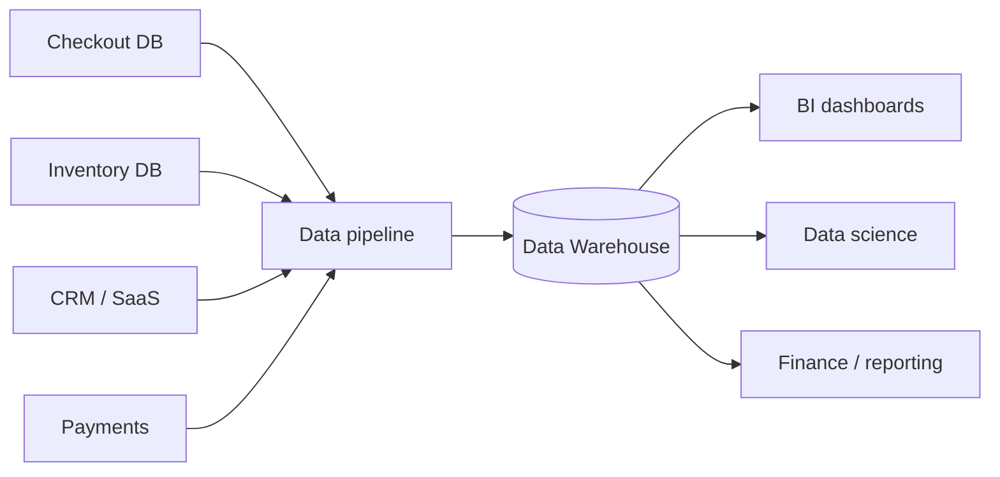
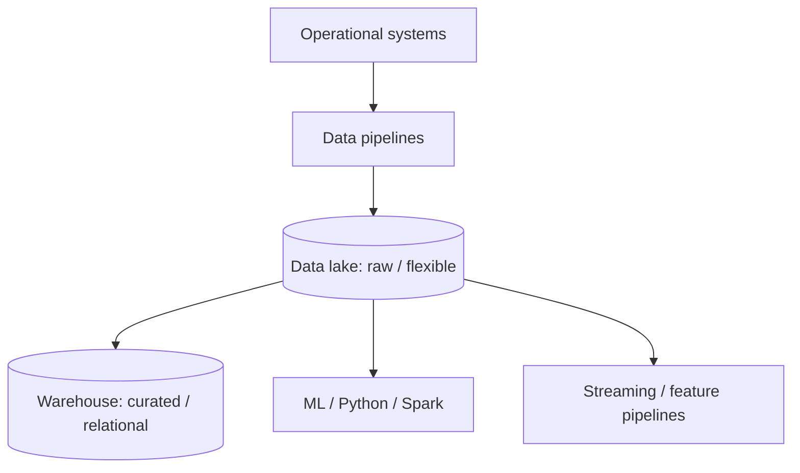
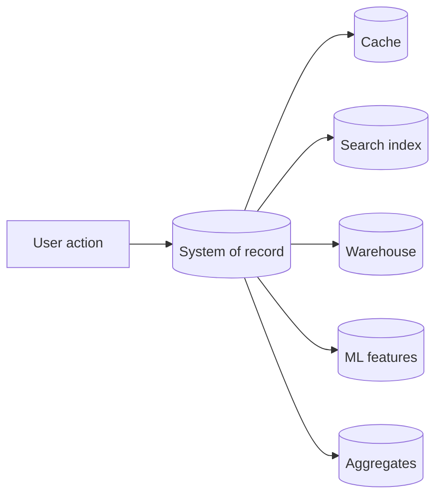
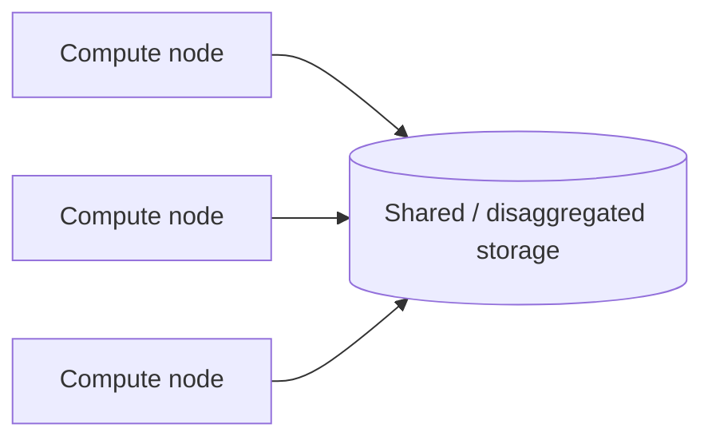
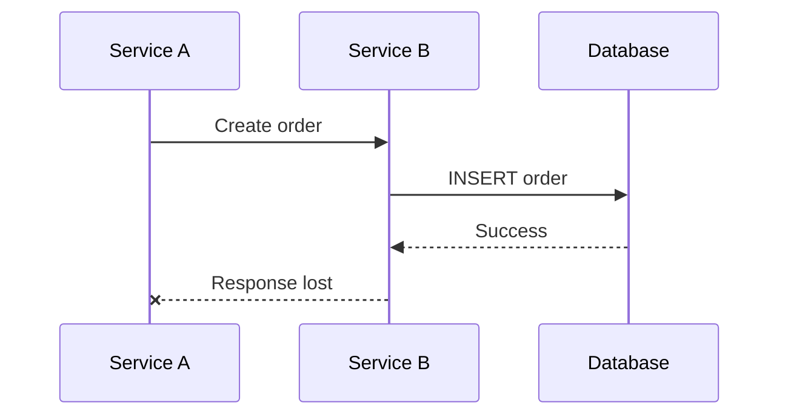
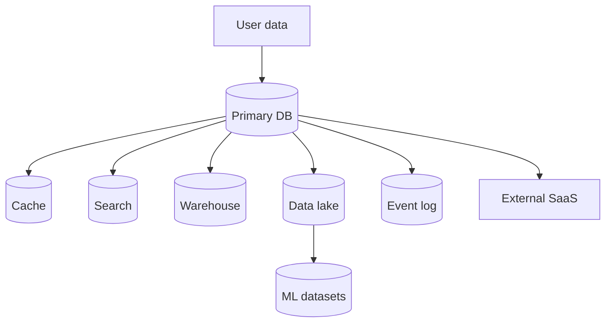
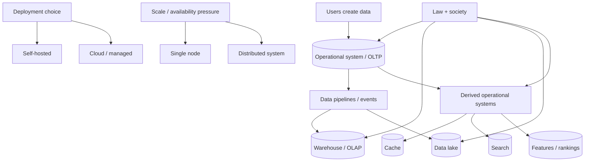

# Trade-Offs in Data Systems Architecture

> This chapter is a learning companion to Chapter 1 of Martin Kleppmann's *Designing Data-Intensive Applications*. It is not a replacement for the book. The goal is to rebuild the chapter's ideas from first principles, connect them into one mental model, and make the material easy to turn into an animated video.

The most important idea in this entire chapter is not OLTP, OLAP, data lakes, cloud computing, or distributed systems.

It is this:

> **Architecture is the art of choosing which problems you are willing to have.**

Almost every architecture diagram hides a trade-off.

Move to the cloud and you may gain elasticity while giving up some control.

Split one database into many services and you may gain independent deployment while creating network, consistency, and observability problems.

Keep everything on one machine and the system may remain beautifully simple, until the workload no longer fits.

Build a data warehouse and analysts gain freedom, but now you have another copy of the data that must be kept fresh.

There is rarely a universally correct architecture. There is an architecture whose disadvantages are acceptable for the problem you actually have.

That is the lens for this chapter.

---

## The story we will follow

Imagine we are building an online store.

A customer opens the app, searches for a laptop, adds it to the cart, pays, and receives an order confirmation.

That one action creates data that different people want to use in completely different ways.

The checkout service wants to answer:

> Has this payment succeeded?

The inventory service wants to answer:

> How many units are left right now?

A finance analyst asks:

> What was revenue by region over the last 90 days?

A data scientist asks:

> Which products tend to be bought together?

A fraud system asks:

> Does this purchase look suspicious compared with millions of earlier purchases?

A privacy team asks:

> Where is this customer's personal information stored, and can we erase it everywhere if required?

It is all "the same data," but the required access patterns are not the same.

That tension explains much of modern data architecture.

---

# 1. First: what makes a system data-intensive?

Some systems are difficult because the computation itself is enormous. Simulating fluid dynamics, training a giant neural network, or rendering a film can be **compute-intensive**.

A data-intensive application has a different center of gravity.

The difficult part is managing data:

- storing large amounts of it,
- reading and updating it efficiently,
- keeping it correct when many users act concurrently,
- surviving failures,
- making it available to different consumers,
- transforming it into useful derived forms,
- and controlling who may use it.

Modern applications therefore assemble several specialized building blocks:

| Need | Typical system |
|---|---|
| Durable application state | Database |
| Reuse expensive results | Cache |
| Search text or structured fields | Search index |
| React to changes continuously | Stream processor |
| Process large accumulated datasets | Batch system |
| Analyze data across the business | Warehouse / lake / analytical database |

A production application is rarely "a database." It is usually a **data system made from several systems**.

That immediately raises the first architectural question:

> If different jobs want different things from data, should one system try to do all of them?

Usually, no.

That brings us to the first major split.

---

# 2. Operational systems vs analytical systems

## 2.1 Two very different questions

Suppose our store has 100 million orders.

A customer opens the order page.

The application asks:

```text
Give me order #ORD-918274.
```

That query probably needs one row, or a handful of related rows.

Now the CFO opens a dashboard.

The dashboard asks:

```text
For every completed order in the last 12 months,
group revenue by country and month,
then compare it with the previous year.
```

That query may inspect millions of rows.

Both queries concern orders.

But computationally they are almost opposites.

### Operational workload

An operational system handles the application's live state.

Typical properties:

- frequent inserts, updates, and deletes,
- low-latency responses,
- many concurrent users,
- queries that touch a small number of records,
- access patterns largely known in advance by application developers.

This style of workload is commonly called **OLTP — Online Transaction Processing**.

"Transaction" here does not mean only financial transactions. A social media post, a game move, a profile update, and a new chat message can all be transactional operations.

### Analytical workload

An analytical system is optimized for asking questions *about* accumulated data.

Typical properties:

- scans over many rows,
- aggregation,
- grouping,
- joins across datasets,
- mostly read-heavy use,
- ad hoc queries written by analysts, data scientists, or BI tools.

This is **OLAP — Online Analytical Processing**.

The core distinction is not "SQL vs NoSQL" or "small database vs big database."

It is the **shape of the work**.

| Property | Operational / OLTP | Analytical / OLAP |
|---|---|---|
| Main goal | Serve the live application | Understand accumulated data |
| Typical query | Fetch/update a few records | Scan/aggregate many records |
| Writes | Frequent | Usually derived from source data |
| Latency expectation | Milliseconds | Seconds to minutes may be acceptable |
| Query shape | Repetitive and known | Exploratory and ad hoc |
| Main users | Application/backend services | Analysts, data scientists, BI |
| Optimization target | Fast point reads/writes | Fast scans and aggregations |

## 2.2 Why not run analytics on the production database?

At first this seems wasteful.

Why copy the same data into another system?

Because a giant analytical query can compete with customer-facing requests for CPU, memory, disk bandwidth, caches, locks, and I/O.

Picture this.

The checkout database is happily answering:

```text
SELECT * FROM orders WHERE id = ?
```

Then an analyst launches:

```text
Scan 800 million order lines,
join products,
join users,
group by region,
calculate 12 months of trends.
```

The query might be perfectly valid.

It can also ruin the latency of the live application.

The second problem is **data silos**.

A real company may have separate operational systems for:

- checkout,
- inventory,
- logistics,
- CRM,
- support,
- subscriptions,
- marketing,
- payments,
- refunds,
- internal finance.

An analyst usually does not want "the checkout database."

They want a view across the company.

This is why operational and analytical systems evolved separately.

---

# 3. The data warehouse: one analytical view of many operational systems

A **data warehouse** is a database designed primarily for analytics.

Instead of letting analysts interrogate every production system directly, data is copied from operational systems into a separate analytical environment.

A simplified flow looks like this:



The warehouse isolates analytical work from the systems that serve customers.

It also gives analysts one place to combine data that originated in many operational systems.

## 3.1 ETL and ELT

The classic pipeline is:

**Extract → Transform → Load**

1. **Extract** data from source systems.
2. **Transform** it into a form that is easier to analyze.
3. **Load** it into the warehouse.

This is ETL.

Modern warehouses are powerful enough that many teams instead load the raw-ish data first and transform it inside the analytical platform:

**Extract → Load → Transform**

That is ELT.

The important idea is not the acronym.

It is that **data crosses a boundary from the operational world into the analytical world**.

Once that boundary exists, questions appear:

- How quickly should changes arrive?
- What if the pipeline fails halfway?
- Can records arrive twice?
- Can data arrive out of order?
- If the source schema changes, what breaks?
- How do we backfill historical data?
- How do we know the warehouse is still consistent with the source?

These questions will return throughout the book.

## 3.2 Why specialized analytical systems exist

At small scale, one general-purpose relational database can often handle both operational and analytical work.

At larger scale, specialization becomes attractive.

Operational databases optimize for locating and modifying a small amount of data quickly.

Analytical engines optimize for reading selected columns across huge numbers of rows and performing aggregates efficiently.

The lesson is broader than databases:

> **When workloads diverge, data systems tend to specialize.**

This is why "one database for everything" is tempting early and increasingly difficult later.

---

# 4. From warehouse to data lake

A warehouse is structured.

That is useful, but it can become restrictive when data scientists want to work with:

- images,
- audio,
- video,
- raw logs,
- events,
- text,
- embeddings,
- feature matrices,
- model training datasets,
- semi-structured records.

A **data lake** takes a looser approach.

Instead of forcing all data into relational tables first, it stores data as files in a large shared repository, often on inexpensive object storage.



The warehouse says:

> Put data into a model designed for analysis.

The lake says:

> Keep a broad copy of useful data, including forms that do not fit neatly into tables.

Neither philosophy is automatically superior.

A lake without governance can become a "data swamp": many files, unclear ownership, inconsistent schemas, mysterious freshness, and no idea which dataset should be trusted.

A warehouse can become too rigid or too expensive for exploratory and unstructured workloads.

Again: trade-offs.

---

# 5. The distinction that simplifies everything: system of record vs derived data

This is one of the most useful mental models in the chapter.

Suppose an order exists in PostgreSQL.

From that order we create:

- a search document in Elasticsearch,
- a warehouse row,
- a cached representation in Redis,
- an aggregate in a dashboard,
- an ML feature,
- an event in a stream,
- a recommendation signal.

Which copy is "the truth"?

The **system of record** is the authoritative copy.

It is also called the **source of truth**.

When new information enters the organization, the canonical version is written there.

Everything computed from that source is **derived data**.



A powerful test is:

> If this dataset disappeared completely, could we rebuild it from another authoritative dataset?

If yes, it is probably derived.

If no, it may contain primary information that needs its own durability guarantees.

This distinction changes how we think about failures.

Losing a cache is inconvenient.

Losing the only copy of confirmed customer orders is catastrophic.

Derived data may be very expensive to regenerate, so "derived" does not mean "unimportant." It means its correctness is defined relative to some upstream data.

## 5.1 A subtle problem: derived data can flow back into live products

The architecture is no longer always:

```text
operational → analytics → human looks at dashboard
```

Today it is often:

```text
operational → analytics / ML → derived result → operational product
```

Examples:

- recommendations,
- fraud scores,
- search ranking,
- dynamic pricing,
- abuse detection,
- personalization.

This closes the loop.

Analytical systems are not merely reporting systems anymore. Their outputs can change what users see and what the application does.

That makes data freshness, lineage, reproducibility, and correctness operational concerns.

---

# 6. Cloud vs self-hosting

Now imagine our store is growing.

Where should all these systems run?

Historically, organizations bought or leased machines, installed software, replaced failed hardware, planned capacity, and ran their own infrastructure.

Cloud computing changes the ownership boundary.

Instead of buying a server, you rent infrastructure or a managed service.

That sounds like an implementation detail.

It is not.

It changes cost models, operational responsibility, system architecture, failure assumptions, and even which database designs are practical.

---

## 6.1 Why cloud services are attractive

Cloud infrastructure can provide several advantages.

### Elasticity

Capacity can be added without waiting for hardware procurement.

If traffic grows quickly, the organization can often provision more compute much faster than it could buy and install physical servers.

### Managed operations

A managed database may handle parts of:

- hardware replacement,
- backups,
- software upgrades,
- replication,
- failover,
- monitoring,
- security patches.

That can let a small team operate systems that would otherwise require specialists.

### Fast experimentation

A team can provision a database, queue, object store, or GPU cluster quickly, test an idea, and delete it.

### Global infrastructure

Cloud providers operate data centers across many geographical regions, making it easier to deploy close to users or satisfy some residency requirements.

But none of those benefits is free.

---

## 6.2 The cloud bill is not the same thing as the cost of infrastructure

A common mistake is comparing:

```text
monthly cloud invoice
vs
price of physical server
```

That comparison is incomplete.

Self-hosting also includes:

- facilities,
- networking,
- storage,
- power,
- redundancy,
- hardware failures,
- spare capacity,
- upgrades,
- staff time,
- on-call operations,
- procurement,
- depreciation,
- disaster recovery.

Cloud computing packages many of these costs into service pricing.

However, at sufficiently stable and large scale, the provider's margin and usage pricing can make cloud substantially more expensive than owned infrastructure.

So the correct question is not:

> Is cloud cheaper?

It is:

> For our workload, growth pattern, staffing, risk profile, and ability to operate infrastructure well, which cost structure is better?

A startup with unpredictable demand and five engineers faces a different answer than a mature company running a stable fleet at enormous scale.

---

## 6.3 Managed convenience creates dependency

A managed service can remove operational work.

It can also create dependencies on:

- provider APIs,
- proprietary database features,
- pricing changes,
- region availability,
- quotas,
- product deprecations,
- egress fees,
- support quality.

This is sometimes called vendor lock-in, but "lock-in" is too simplistic.

Every technology choice creates switching cost.

Even moving from one open-source database to another may require schema changes, application changes, migrations, retraining, and operational work.

The engineering question is:

> What dependency are we accepting, and what are we receiving in return?

---

# 7. Cloud-native architecture: the architecture changes when infrastructure changes

Running the same old software on rented virtual machines is "in the cloud," but it does not fully exploit the cloud environment.

Cloud-native systems often assume:

- machines are replaceable,
- storage can be network-accessible,
- compute can be elastic,
- services may be managed independently,
- failures are normal,
- infrastructure is provisioned through APIs.

This produces new architectural patterns.

## 7.1 Separation of storage and compute

Traditional databases often assume the machine that performs computation also owns local disks containing the database.

Cloud systems can decouple those roles.



Now compute can potentially be:

- added,
- removed,
- restarted,
- resized,

without moving the entire durable dataset with it.

This pattern appears in cloud-native databases and analytical systems.

But disaggregation introduces a different dependency:

> the network is now part of the storage path.

A local disk access and a network request have different latency and failure characteristics.

So separation gives elasticity and independent scaling while demanding clever caching, replication, prefetching, and failure handling.

Again: architecture is a trade.

## 7.2 Layering cloud services

A "managed database" may itself be built on many layers:

```text
database engine
    ↓
virtual machines / containers
    ↓
network block or object storage
    ↓
cloud networking
    ↓
physical hosts
    ↓
data-center hardware
```

Each layer hides complexity.

Each layer can also fail.

A useful systems mindset is to ask:

> What assumptions does this layer make about the layer below it?

That question becomes extremely important when debugging latency spikes and failures in distributed infrastructure.

---

# 8. Operations did not disappear in the cloud

"Managed" does not mean "no operations."

Someone still needs to decide:

- how much redundancy is required,
- which regions are used,
- what the backup retention is,
- who has access,
- which metrics matter,
- how incidents are detected,
- what an acceptable recovery time is,
- how deployments are rolled back,
- how costs are controlled.

The cloud changes **who operates which layer**.

It does not make operational thinking optional.

This is why site reliability engineering, platform engineering, and cloud operations remain important even when an organization uses managed services.

---

# 9. Distributed vs single-node systems

Eventually every systems engineer meets a seductive idea:

> We should make it distributed.

Distribution can provide:

- more total capacity,
- redundancy,
- geographic placement,
- independent scaling,
- parallelism.

It can also create an entire new class of failure modes.

Before distributing a system, ask a more boring question:

> Can one machine solve the problem?

Modern machines are surprisingly powerful.

A single server may have:

- many CPU cores,
- hundreds of gigabytes or even terabytes of RAM,
- multiple high-speed SSDs,
- very high network throughput.

For many workloads, vertical scaling can go much further than engineers expect.

A single-node system has an extraordinary property:

> Many operations are local.

There is no network partition between two processes on the same machine.

There is no distributed consensus required to coordinate two copies if there is only one authoritative process.

There are fewer clocks, fewer partial failures, fewer retry paths, and fewer states the system can enter.

Simplicity is a performance feature and a reliability feature.

---

# 10. Why distributed systems are hard

A single machine can fail.

A distributed system can **partially fail**.

That distinction changes everything.

Consider three services:



What does Service A know?

It sent a request.

It did not receive a response.

Did the operation fail?

Maybe.

Did it succeed and the response disappear?

Also maybe.

Should A retry?

If it retries, could it create the order twice?

This ambiguity does not exist in the same form inside a single process.

A distributed system must handle:

- network delays,
- packets lost or duplicated,
- nodes that pause,
- nodes that crash,
- nodes that restart with stale state,
- clocks that disagree,
- messages arriving out of order,
- retries that repeat side effects,
- partitions where some nodes can communicate and others cannot.

The difficult part is not that everything breaks at once.

The difficult part is that **some parts continue working while other parts do not**.

That is why distributed systems require explicit protocols for coordination, replication, idempotency, consensus, timeouts, and recovery.

---

# 11. Then why distribute at all?

Because sometimes one machine is not enough.

There are several common reasons.

## 11.1 Data volume

The dataset may not fit economically on one machine.

## 11.2 Throughput

One machine may not handle the number of reads, writes, or computations required.

## 11.3 Availability

If one machine fails and the product must stay online, redundant copies may be needed.

## 11.4 Geography

Users may be far from one data center. Serving them from multiple regions can reduce latency and satisfy residency requirements.

## 11.5 Organizational scaling

Different teams may need to deploy and own parts of a large system independently.

The important rule is:

> **Distribution should be introduced to solve a concrete constraint, not because distribution looks architecturally sophisticated.**

---

# 12. Microservices and serverless: distribution can enter through software organization

A monolithic application can run many capabilities inside one process or one deployable unit.

A microservice architecture splits those capabilities into separately deployed services, often communicating over a network.

Potential benefits include:

- independent deployment,
- independent scaling,
- smaller code ownership boundaries,
- technology choices per service,
- fault isolation in some scenarios.

But a function call becomes a network call.

That means a previously simple dependency may now require:

- serialization,
- authentication,
- retries,
- timeouts,
- observability,
- API versioning,
- distributed tracing,
- compatibility management.

A database transaction that once updated two tables may become a workflow spanning two services that cannot share one simple transaction.

Microservices therefore trade **local complexity** for **distributed coordination complexity**.

Serverless computing takes another step by letting the cloud platform manage more of the execution environment and scaling.

This can be excellent for bursty workloads and event-driven tasks.

It can also introduce constraints around cold starts, execution duration, state management, debugging, pricing, and platform dependency.

Neither model is "modern therefore better."

Use the model whose failure modes and operational burden fit the problem.

---

# 13. Cloud computing and supercomputing solve different problems

A distributed cloud application and a supercomputer may both contain thousands of machines.

They are optimized for different assumptions.

A high-performance computing workload often runs a tightly coordinated calculation across nodes that are expected to be available together.

A cloud application often runs continuously and assumes individual machines can fail or disappear while the overall service continues.

Very roughly:

| Cloud service architecture | High-performance computing |
|---|---|
| Long-running online services | Bounded computational jobs |
| Commodity/fungible nodes | Tightly controlled cluster |
| Partial failures expected | Coordinated job execution |
| High availability often important | Maximum compute throughput often central |
| Data/service continuity | Parallel computation efficiency |

The hardware can look similar from far away.

The software assumptions are very different.

---

# 14. Data systems are not only technical systems

The final section of the chapter changes the frame.

Suppose an engineer says:

> We keep every event forever because storage is cheap. It might be useful later.

Technically, that sounds convenient.

Legally and ethically, it may be unacceptable.

A data architecture exists inside society.

It is constrained not only by:

- latency,
- throughput,
- durability,
- scalability,
- cost,

but also by:

- privacy,
- user consent,
- retention limits,
- data residency,
- purpose limitation,
- deletion rights,
- access control,
- auditability,
- regulation.

This means laws and social expectations can become architecture requirements.

---

# 15. Privacy requirements become systems problems

Imagine a user requests deletion of their account.

In a simple application with one database:

```text
users table → delete row
```

Even that is more complicated than it looks, but the rough shape is understandable.

Now consider a modern data platform.

The user's data may exist in:

- primary database,
- read replicas,
- cache,
- search index,
- warehouse,
- data lake,
- event log,
- backups,
- ML training dataset,
- feature store,
- logs,
- third-party SaaS tools.



Now "delete the user's data" is no longer one SQL statement.

It is a **data-lineage problem**.

You need to know:

1. where the data originated,
2. every place it was copied,
3. every dataset derived from it,
4. which copies are legally required to be retained,
5. which copies must be removed,
6. whether backups should expire rather than be rewritten,
7. whether a trained model is considered to contain recoverable personal information.

Notice what happened.

A legal requirement became an architectural requirement.

The same applies to access controls, residency, encryption, audit logs, consent, and retention.

---

# 16. The deeper lesson: every optimization creates a new responsibility

Let's revisit the choices in this chapter.

We separate OLTP and OLAP to protect production latency.

Now we must build pipelines and manage duplicated data.

We create a warehouse to unify analytics.

Now we must manage schema evolution, freshness, and governance.

We add a data lake for flexibility.

Now we must prevent it from becoming an undocumented swamp.

We use caches and search indexes for speed.

Now we must keep derived copies synchronized.

We use cloud services to reduce infrastructure work.

Now we depend on providers, service limits, pricing, and layered failure domains.

We distribute across nodes for scale and availability.

Now we must handle partial failure and coordination.

We collect more data to improve products.

Now we must govern how that data is used, retained, and deleted.

A useful way to read architecture diagrams is therefore:

> **For every box someone added, ask which problem it solved and which new problem it created.**

That single question will make the rest of *Designing Data-Intensive Applications* much easier to understand.

---

# 17. One architecture, seen through all of Chapter 1

Return to our online store.

A customer places an order.

### Step 1: operational write

The checkout service writes the order to an operational database.

That database is optimized for low-latency, concurrent transactions.

```text
Customer → Checkout API → Orders DB
```

### Step 2: derived copies

The order may be propagated to:

- Redis for fast reads,
- Elasticsearch/OpenSearch for search,
- Kafka for events,
- warehouse for analytics,
- fraud pipeline,
- recommendation features.

The orders database remains the system of record for the order.

Most other representations are derived.

### Step 3: analytics

The warehouse combines orders with product, marketing, support, and payment data.

Analysts ask questions spanning millions of records without hurting checkout traffic.

### Step 4: lake / ML

Raw event data and other files land in object storage.

Data scientists train models and generate features.

### Step 5: cloud infrastructure

Compute and storage may live on managed cloud services.

Some systems may separate compute from durable storage to scale each independently.

### Step 6: distribution

Traffic grows.

The company may add replicas, partitions, queues, and geographically distributed services.

Every new network boundary introduces partial-failure behavior.

### Step 7: law and society

The data platform must answer questions such as:

- Who may access this information?
- How long may it be kept?
- In which country may it be stored?
- How can a user's data be located and erased?
- Is this derived dataset still personal data?

The architecture is now shaped by engineering, economics, organizational structure, and law.

That is the chapter.

---

# 18. A decision framework for real systems

When evaluating any data-system choice, ask these questions before naming a technology.

## 18.1 What is the access pattern?

- point lookups?
- sequential scans?
- range queries?
- aggregates?
- graph traversal?
- full-text search?
- vector similarity?
- event stream?

## 18.2 What changes?

- mostly reads?
- frequent writes?
- append-only events?
- mutable records?
- large bulk updates?

## 18.3 What latency actually matters?

Do not say "low latency."

Say:

- p50 under 20 ms?
- p99 under 200 ms?
- report under 30 seconds?
- daily batch by 6 AM?

Architecture becomes easier when requirements are measurable.

## 18.4 How much data and traffic exist now?

And separately:

> How much do we realistically expect in the next 12–24 months?

Do not build for a fictional billion-user future unless the present architecture creates a dead end.

## 18.5 What happens if the system is unavailable?

Is the failure:

- mildly annoying,
- revenue-impacting,
- safety-critical,
- legally significant?

Availability requirements should follow business impact.

## 18.6 Which data is authoritative?

Write down the system of record.

If the team cannot answer this clearly, conflicting copies will eventually create painful incidents.

## 18.7 Which data is derived?

For each derived dataset, define:

- source,
- transformation,
- freshness expectation,
- owner,
- rebuild strategy.

## 18.8 What failure modes does the new component introduce?

For a queue:

- duplication,
- ordering,
- lag,
- poison messages.

For a cache:

- staleness,
- eviction,
- stampedes.

For a distributed database:

- replica lag,
- partitions,
- failover behavior,
- consistency trade-offs.

For a cloud service:

- quota,
- region outage,
- provider dependency,
- pricing.

## 18.9 What is the exit cost?

Not "can we migrate?"

Almost anything can be migrated with enough money.

Ask:

> What would migration require in code, data movement, downtime, retraining, and operational effort?

## 18.10 What are the legal constraints?

- retention,
- deletion,
- residency,
- consent,
- audit,
- access,
- encryption.

Treat these as system requirements, not paperwork added after launch.

---

# 19. What not to conclude from this chapter

## "OLTP means relational database"

No.

OLTP describes an access pattern. Many kinds of databases can serve operational workloads.

## "OLAP means nightly reports"

No.

Analytical systems can ingest and query data in near real time. Product analytics systems such as ClickHouse, Apache Druid, and Apache Pinot are examples of analytical engines built for low-latency queries over large datasets.

## "Data lake is the modern replacement for a warehouse"

Not necessarily.

They solve overlapping but different needs, and many architectures use both.

## "Cloud is always cheaper"

No.

Its value depends on utilization, scale, staffing, growth uncertainty, operational maturity, and the managed services being used.

## "Self-hosting means bare metal in an office"

No.

You can self-manage software on rented machines, colocated hardware, private clouds, or public-cloud VMs.

## "Distributed is more scalable, therefore better"

It can scale further, but it creates coordination and failure complexity.

A single-node design that comfortably meets requirements is often the stronger design.

## "Derived data can be ignored because it can be rebuilt"

No.

It can still be expensive, slow, business-critical, privacy-sensitive, or impossible to reproduce exactly if code and upstream data have changed.

---

# 20. Video treatment: how to make this chapter visual rather than lecture-like

The video should not begin with definitions.

Begin with **one order**.

A customer taps **Buy**.

Freeze the screen.

Then ask:

> Where does this one order go?

The order card travels through the architecture.

That same object becomes the visual anchor for the whole episode.

## Scene 1 — One order becomes many copies

**Hook**

A single order appears in the checkout database.

Then copies shoot outward:

```text
orders DB
 ├── cache
 ├── search
 ├── event stream
 ├── warehouse
 ├── data lake
 └── fraud model
```

Narration idea:

> "One customer clicked Buy once. So why did our system create six versions of the same fact?"

That immediately creates curiosity.

**Viewer question:** Why does modern architecture duplicate data so much?

**Payoff:** Different access patterns require different systems.

---

## Scene 2 — OLTP vs OLAP as two camera lenses

Show the same orders table.

Camera A zooms into one order:

```text
ORD-918274
```

Camera B pulls outward until millions of rows fill the screen.

Operational query:

> "Where is this order?"

Analytical query:

> "What happened across every order this year?"

Do not teach OLTP/OLAP first.

Let the viewer *feel* the difference, then name it.

---

## Scene 3 — The analyst attacks production

Show customer requests entering smoothly.

Then a giant analytical query arrives like a freight train and consumes CPU / I/O.

Latency gauges climb.

The production system turns red.

Then physically split the architecture:

```text
production DB  →  pipeline  →  warehouse
```

The dashboard query moves to the right.

The checkout latency returns to normal.

**Payoff:** the warehouse exists partly to create an analytical failure/performance boundary.

---

## Scene 4 — Warehouse to lake

Start with neat warehouse tables.

Then throw in:

- image,
- audio waveform,
- JSON event,
- Parquet file,
- model vector,
- video frame.

The rigid table struggles to absorb everything.

Pull the camera back to reveal object storage containing many file types.

Then show curated subsets flowing back into warehouse tables.

**Question:** What if the useful data does not naturally look like rows and columns?

---

## Scene 5 — The red crown: system of record

Show six copies of an order.

Put a red crown above the authoritative one.

Delete Redis.

It regenerates.

Delete search index.

It rebuilds.

Delete warehouse table.

Pipeline recreates it.

Delete the crowned order database.

Everything freezes.

**Payoff:** source of truth vs derived data becomes visually unforgettable.

---

## Scene 6 — Cloud vs self-hosting as responsibility transfer

Do not draw a generic cloud icon.

Draw a vertical stack of responsibilities:

```text
application
database software
OS
VM / machine
disk
network
rack
power
building
```

For self-hosting, the company's color covers most of the stack.

For managed cloud, slide the ownership boundary upward.

The viewer sees that "cloud" means **moving responsibility boundaries**, not making infrastructure disappear.

---

## Scene 7 — Separation of storage and compute

Draw a classic database server as one machine:

```text
CPU + RAM + SSD
```

Then pull the SSD out and place durable storage behind the network.

Duplicate compute nodes above it.

Scale compute from 1 → 3 → 8 while storage remains.

Then briefly flash the cost:

> The network is now in the storage path.

That one animation explains both the benefit and the trade-off.

---

## Scene 8 — Single machine vs distributed

Put the whole store on one huge server.

Make it work.

Then ask:

> "If this machine already handles the load, what problem would splitting it solve?"

Only after a real constraint appears—capacity, availability, geography—split the node.

This avoids teaching distribution as an achievement.

Teach it as a cost paid to overcome a limit.

---

## Scene 9 — The impossible retry

Animate:

1. Service A sends "create order".
2. Service B writes the order.
3. The reply packet disappears.

Freeze time.

Ask the viewer:

> Did the order happen?

Show both possibilities simultaneously.

Then show a retry producing a duplicate order.

This is the first emotional taste of distributed-systems ambiguity.

No CAP theorem needed yet.

---

## Scene 10 — Deleting one user

End with the strongest scene.

A user presses:

> Delete my account.

The button sends a red pulse through the architecture.

The pulse easily removes the primary row.

Then the camera pulls back.

Copies appear in:

- cache,
- search,
- warehouse,
- lake,
- Kafka log,
- backups,
- ML data,
- SaaS.

The small red pulse now has an enormous graph to traverse.

Final line:

> "The architecture of a data system is not determined only by what the business wants to compute. It is also determined by what society allows the business to remember."

That is a much stronger ending than a recap slide.

---

# 21. Suggested video arc

For a 25–35 minute episode:

| Approx. time | Segment |
|---:|---|
| 0:00–2:00 | Hook: one order becomes many copies |
| 2:00–6:00 | OLTP vs OLAP |
| 6:00–10:00 | Warehouse, ETL/ELT |
| 10:00–13:00 | Lake and modern analytical flow |
| 13:00–16:00 | System of record vs derived data |
| 16:00–21:00 | Cloud vs self-hosting |
| 21:00–24:00 | Cloud-native, storage/compute separation |
| 24:00–29:00 | Single-node vs distributed |
| 29:00–32:00 | Microservices/serverless and partial failure |
| 32:00–35:00 | Law, privacy, deletion, final synthesis |

The pacing should alternate between:

**concrete problem → visual model → terminology → consequence → next problem**

Avoid blocks of definition followed by another block of definition.

---

# 22. The entire chapter in one diagram



The arrows tell the story:

1. Users create facts in operational systems.
2. Pipelines copy those facts into analytical and derived systems.
3. Infrastructure can be self-hosted or cloud-managed.
4. Systems may stay on one node or become distributed when constraints demand it.
5. Every copy and every transformation remains subject to legal and social requirements.

---

# 23. Mental model to keep for the rest of the book

When you encounter a new technology in later chapters, do not ask first:

> Is this technology good?

Ask:

1. **What workload was it designed for?**
2. **Which problem does it remove?**
3. **Which new failure modes does it introduce?**
4. **What data is authoritative?**
5. **What is derived?**
6. **What happens when it is stale?**
7. **What happens when it is unavailable?**
8. **What happens when the network fails?**
9. **What does operating it cost?**
10. **What legal obligations follow from storing the data there?**

That is the real skill this chapter is trying to build.

---

# 24. References and further reading

The chapter itself points to a useful set of primary and secondary sources. These are especially valuable if this material is turned into a research-heavy video.

1. Richard T. Kouzes et al., **"The Changing Paradigm of Data-Intensive Computing"**, *IEEE Computer* (2009). DOI: https://doi.org/10.1109/MC.2009.26
2. Martin Kleppmann, Adam Wiggins, Peter van Hardenberg, and Mark McGranaghan, **"Local-First Software: You Own Your Data, in Spite of the Cloud"** (Onward! 2019). https://doi.org/10.1145/3359591.3359737
3. Surajit Chaudhuri and Umeshwar Dayal, **"An Overview of Data Warehousing and OLAP Technology"** (1997). https://doi.org/10.1145/248603.248616
4. Fatma Özcan, Yuanyuan Tian, and Pinar Tözün, **"Hybrid Transactional/Analytical Processing: A Survey"** (SIGMOD 2017). https://doi.org/10.1145/3035918.3054784
5. Michael Stonebraker and Uğur Çetintemel, **"'One Size Fits All': An Idea Whose Time Has Come and Gone"** (ICDE 2005). https://doi.org/10.1109/ICDE.2005.1
6. Rihan Hai, Christos Koutras, Christoph Quix, and Matthias Jarke, **"Data Lakes: A Survey of Functions and Systems"** (IEEE TKDE, 2023). https://doi.org/10.1109/TKDE.2023.3270101
7. Alexandre Verbitski et al., **"Amazon Aurora: Design Considerations for High Throughput Cloud-Native Relational Databases"** (SIGMOD 2017). https://doi.org/10.1145/3035918.3056101
8. Panagiotis Antonopoulos et al., **"Socrates: The New SQL Server in the Cloud"** (SIGMOD 2019). https://doi.org/10.1145/3299869.3314047
9. Eric Jonas et al., **"Cloud Programming Simplified: A Berkeley View on Serverless Computing"** (2019). https://arxiv.org/abs/1902.03383
10. Betsy Beyer, Jennifer Petoff, Chris Jones, and Niall Richard Murphy, **Site Reliability Engineering: How Google Runs Production Systems**. https://sre.google/sre-book/table-of-contents/

---

# 25. Final takeaway

The chapter can be reduced to one principle:

> **Every architecture is a set of trade-offs between competing goals.**

Operational and analytical systems split because their workloads pull storage in different directions.

Warehouses and lakes exist because organizations need derived views of operational data.

Systems of record and derived systems exist because not every copy of a fact has the same authority.

Cloud computing changes the boundary of ownership and makes new architectural patterns practical.

Distributed systems provide scale, availability, and geographic reach, but exchange local simplicity for partial failure and coordination.

And data systems live inside law and society, so privacy, deletion, retention, and control are architectural concerns.

The goal is not to memorize which architecture is "best."

The goal is to learn to look at any architecture and ask:

> **What problem was this choice solving, and what price did we agree to pay for it?**
