Most of the time, when a program calls a large language model, it doesn't want language at all. It wants a **decision**: which queue, which agent, yes or no. **Jev**, from TypeSafe, is built around that observation. It never writes text. You give it the state and the question, and it returns a typed answer with a probability for every option.

This video looks at what Jev actually is, where it fits (and where plain code, a boring classifier or an ordinary LLM is the better tool), and three real uses. Every number comes from my own runs against the real API: CLINC150 for the agent router, BANKING77 for the classifier comparison, and Gemini 2.5 Flash as the language-model baseline. Your guide is **Vee**. The two other characters, **Chatty** (a generative model) and **Deci** (a decision model), are metaphors for kinds of systems, not anyone's branding.

> [!TIP] The video in one minute
> If your code only needs a **choice**, don't pay a model to write a paragraph. Jev takes a state and typed questions (**Choice**, **Noul** for yes/no, **Score**), and returns the answer with **probabilities**, in about a third of a second. Probabilities become **thresholds**, and thresholds become **code paths**. Use **code** when the rule is known, a **specialist classifier** when the labels are stable and you have data, a **decision model** when the rule is fuzzy but the answers are known, and a **generative model** when the answer itself is open. It shines as a **router** in agent loops, a **cheap gate** in front of a big model, and a **guardrail** around one. It still needs thresholds and a fallback: a valid answer can be the wrong one.

Below is a written walk through the video. Click any timestamp to jump the player to that moment.

## One ticket, 1.9 seconds, fenced JSON

[▶ 0:22](#t=22)

A support ticket arrives: *I was charged twice. Please fix this ASAP.* We ask a language model to classify it and to return JSON only.

<figure>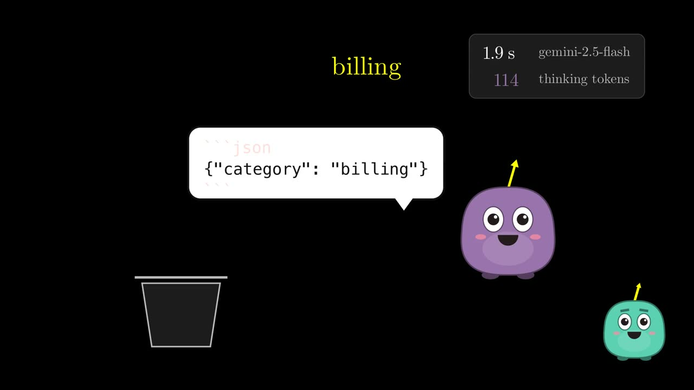<figcaption>One word of answer: 1.9 seconds, 114 hidden thinking tokens, and a Markdown fence around the JSON.</figcaption></figure>

The real call to Gemini 2.5 Flash read 41 tokens of prompt, spent **114 hidden "thinking" tokens** and 11 more writing, and came back after **1.9 seconds**, wrapped in a Markdown code fence that the program then has to strip. You pay for every generated token: 125 of them, to deliver one word. At a few thousand tickets a day that adds up quickly, and the program throws the prose away anyway.

## The program only needed a branch

[▶ 1:25](#t=85)

<figure>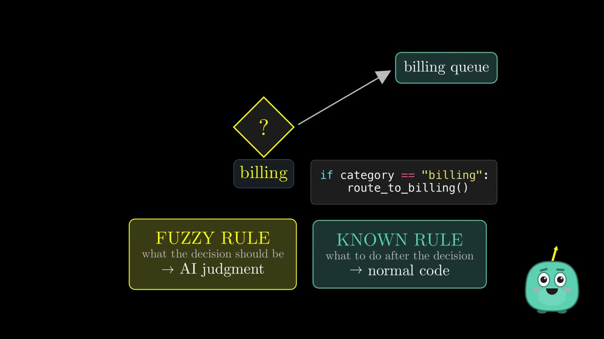<figcaption>Only the choice of branch is fuzzy. What happens after it is plain code.</figcaption></figure>

Look at what the program actually does with the answer: one `if`. Which branch to take is a **fuzzy rule**, a judgment. What to do once you're on the branch is a **known rule**, ordinary code. The language model was only ever needed for the first part.

## Meet Jev, and talk vs decide

[▶ 1:54](#t=114)

<figure>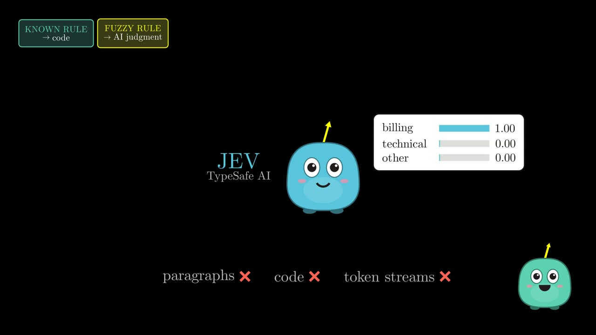<figcaption>Jev's answer to the same ticket: a typed choice, with a probability for each option.</figcaption></figure>

Jev doesn't write paragraphs, code or token streams. Asked the same question, it answered **billing, probability 1.00, in 406 milliseconds**. TypeSafe frames it with Daniel Kahneman's split between fast judgment and slow deliberation: a "System One" model for quick bounded decisions, while generative models do the slow, open-ended work.

<figure>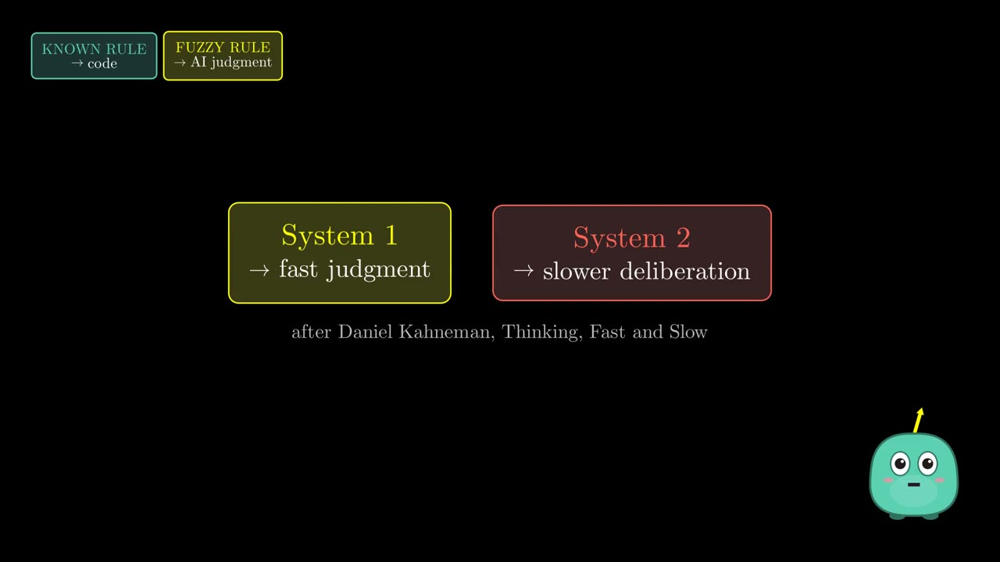<figcaption>After Kahneman: fast judgment vs slower deliberation.</figcaption></figure>

## Criteria defined at runtime

[▶ 3:40](#t=220)

The pitch is not "one classifier for one taxonomy". Same ticket, same model, but this time five different options in the request: refund, duplicate charge, fraud, subscription, other. It picked **duplicate charge, probability 1.00, in 374 ms**, with no training step. The options live in the request, not in the model.

<figure>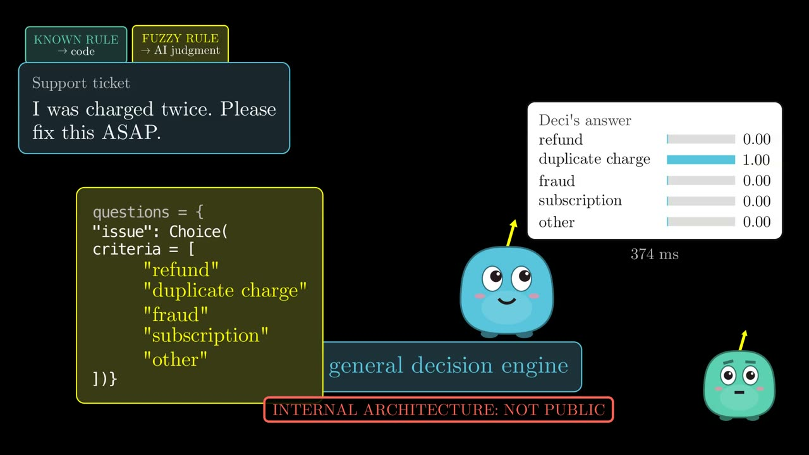<figcaption>New options, no retraining: the criteria are part of the call. TypeSafe hasn't published Jev's internal architecture.</figcaption></figure>

## Choice, Noul, Score

[▶ 4:17](#t=257)

Jev has three question types. **Choice** picks one option from a set. **Noul** answers a yes-or-no question with the probability of yes. **Score** places something on an ordered scale. Soften the ticket ("I think I may have been charged twice, could you check when you get a chance") and it's still billing, but the chance they want a fix drops to **5%**, and urgency slides to medium.

<figure>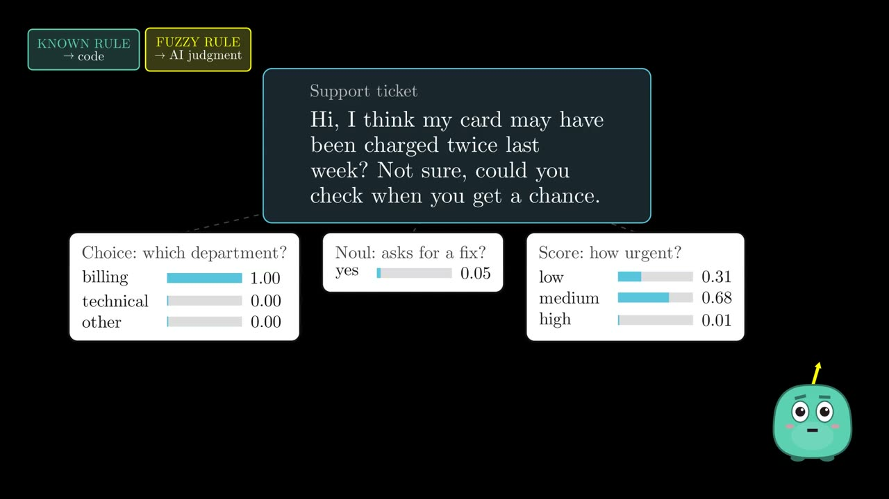<figcaption>The same three questions on a softer ticket: the numbers move.</figcaption></figure>

## A probability becomes a code path

[▶ 4:51](#t=291)

<figure>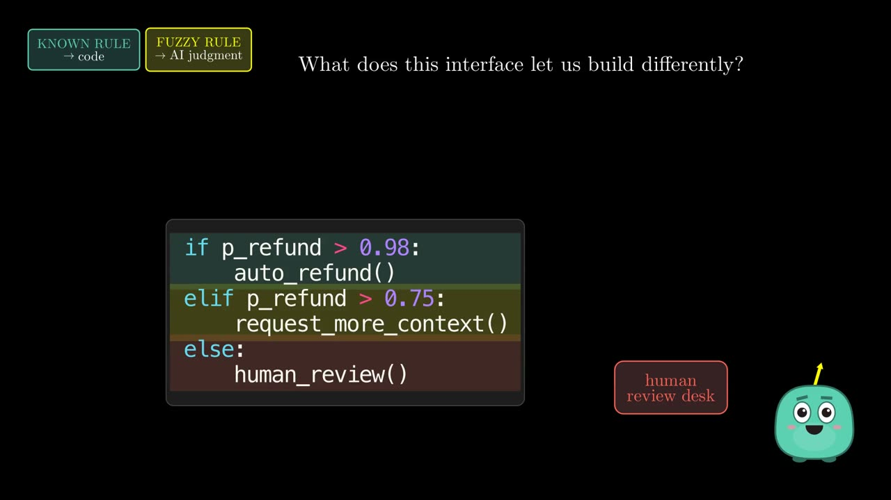 0.98: auto_refund() elif p_refund > 0.75: request_more_context() else: human_review()" /><figcaption>The probability is part of the program: thresholds pick the path.</figcaption></figure>

The useful part isn't the label, it's the number. Above 98%, refund automatically. Above 75%, ask for more context. Below that, a person looks at it. The exact business rule stays in code; the model only supplies the fuzzy judgment.

## Where it fits: code, classifier, decision model, LLM

[▶ 5:18](#t=318)

**Known rule? Write code.** Should we charge an overdraft fee when the balance drops below zero? That's one line. Asking a model would be paying for a guess on something you already know exactly.

**Stable labels and training data? Try a classifier first.** On the same 1,001 BANKING77 tickets, the most boring model I could think of (word counts and a logistic regression, trained on 10,003 labelled examples) got **88.7%**. Jev, given only the label names, got **78.8%**. And the boring model runs on a laptop in a fraction of a millisecond, costs nothing per call, and keeps your data private.

<figure>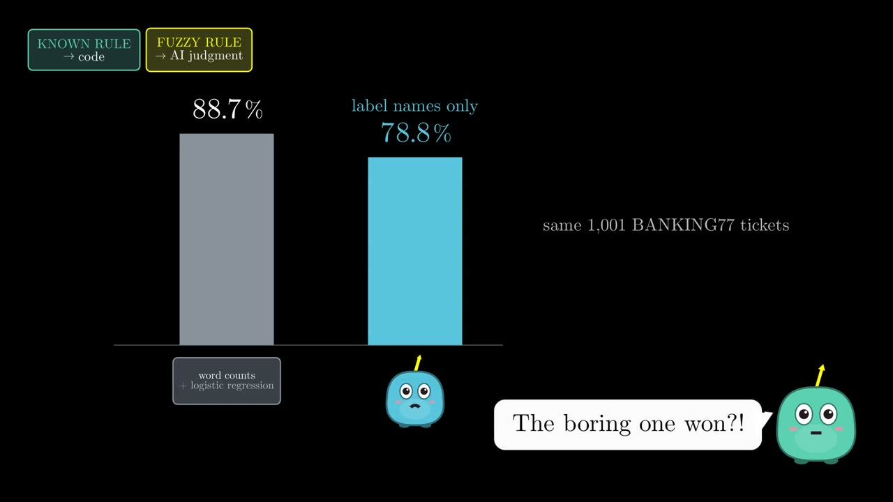<figcaption>The boring one won, on a stable task with training data.</figcaption></figure>

**Labels that change every week? That's Jev's territory.** This week refund, bug, fraud; next week chargeback, duplicate, subscription; the week after, different rules for every country. A trained classifier has to be relabelled and retrained every time. A decision model takes the new list in the next request.

<figure>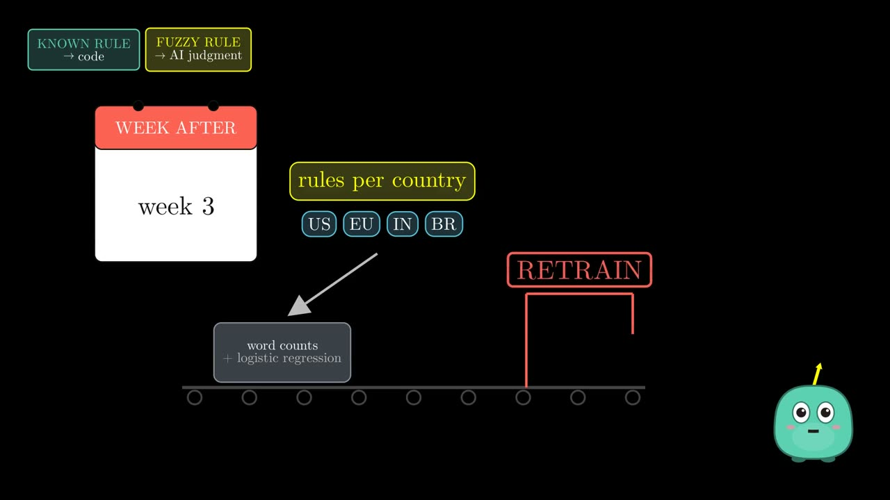<figcaption>Every change of criteria sends a trained classifier back to RETRAIN.</figcaption></figure>

**Open answers? Use a generative model.** "Explain why this customer's refund was denied, and draft a reply" has no list of allowed answers. That's Chatty's job, and it's good at it.

<figure>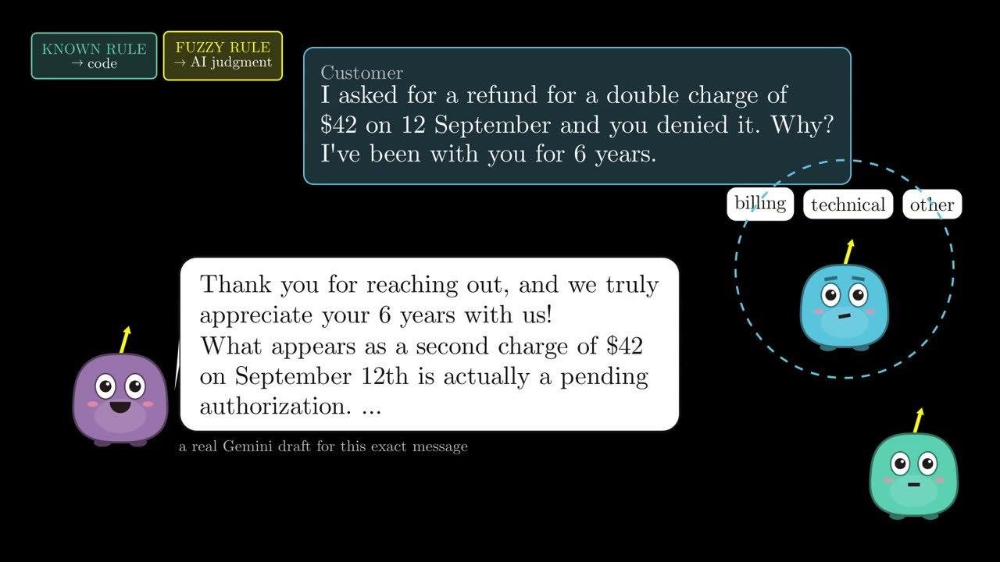<figcaption>A real Gemini draft for this exact message. None of Deci's cards fit.</figcaption></figure>

## The decision map

[▶ 7:24](#t=444)

<figure>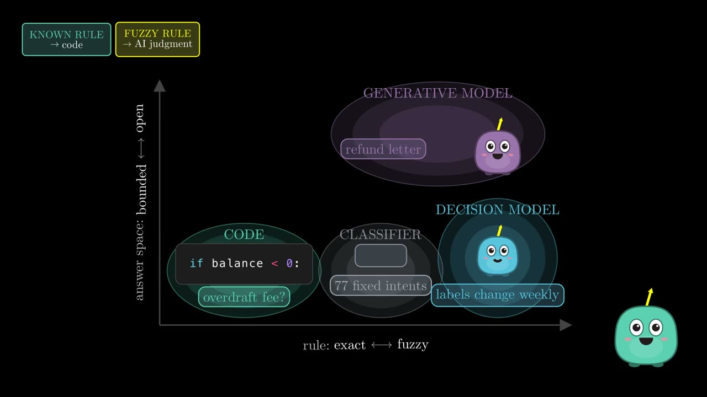<figcaption>Four soft regions, no hard walls.</figcaption></figure>

Across: how exact the rule is. Up: how open the answer space is. The one sentence to keep:

> Use **code** when the rule is known. Use a **decision model** when the rule is fuzzy but the answers are known. Use a **generative model** when the answers themselves are open. And if the task is stable with lots of labels, benchmark a specialist classifier first.

## An agent router: four decisions in one call

[▶ 8:14](#t=494)

I took CLINC150, a public dataset with ten domains, and made each domain an agent (banking, travel, work, home and so on), plus a door for requests no agent should handle. Then I routed 600 real requests.

<figure>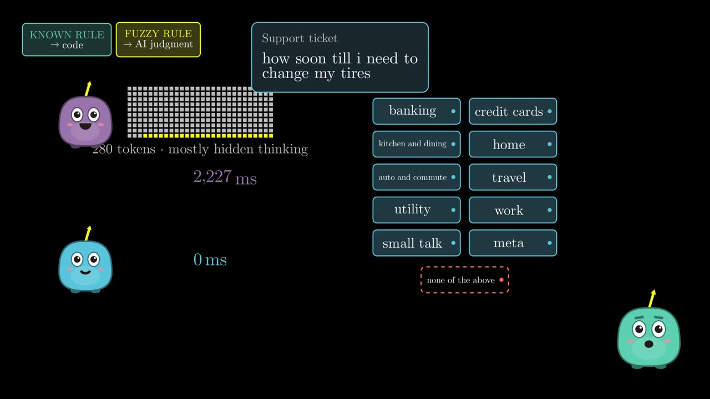<figcaption>Gemini thinks about 280 tokens to write one agent's name; Jev just picks.</figcaption></figure>

Picking the right agent, both are close: Gemini **98%**, Jev **96%**. But Gemini generated about **280 tokens**, mostly hidden thinking, to output one name, at a median of **2.2 seconds**. Jev took **a third of a second**. And when a request fit no agent, Jev said so **74%** of the time, Gemini **61%**.

The bigger difference is inside an agent loop, where every step needs several decisions: which agent, does it need a human, how urgent, is it small talk. **One Jev call answered all four in 342 ms**; four separate Gemini calls took **15.9 seconds**. Over a 20-step run that's about seven seconds against more than five minutes.

## A cheap gate before the big model

[▶ 9:19](#t=559)

Put the cheap decision model in front of the expensive one: confident cases go straight to code, and only the ambiguous ones go to the language model.

$$ E[C] = C_{\text{Jev}} + P(\text{escalate})\, C_{\text{LLM}} $$

<figure>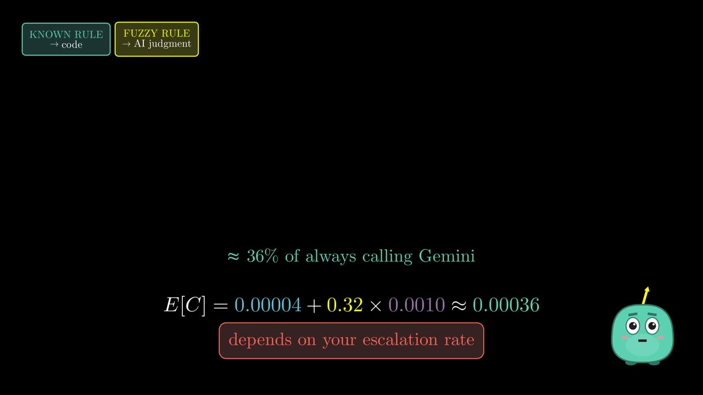<figcaption>With my real prices and a 32% escalation rate: about a third of always calling Gemini.</figcaption></figure>

With real prices, one Jev decision costs about four thousandths of a cent and one Gemini call about a tenth of a cent. If a third of the cases escalate, the average cost per ticket falls to roughly a third of always calling Gemini. The saving depends entirely on your escalation rate.

## A guardrail around the LLM

[▶ 10:04](#t=604)

Flip it around: let the big model draft a reply, and before it's sent, ask Jev one question: *does this reply promise a refund?* A real draft ("we are immediately processing a full refund…") scored **0.99** and went to review. Another ("cash deposits usually take 1–2 business days…") scored **0.02** and was sent.

<figure>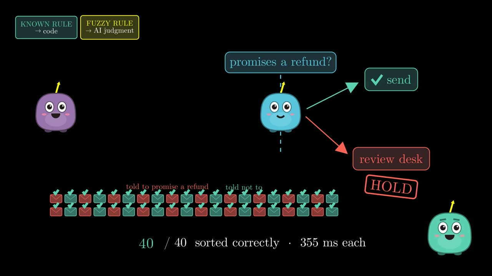<figcaption>40 of 40 real drafts sorted correctly, about a third of a second each.</figcaption></figure>

I tested forty drafts, half told to promise a refund and half told not to. Jev sorted all forty correctly. It may be most useful not as the main model, but as **the model around the main model**: proposal, then decision layer, then execution.

## Where it breaks

[▶ 10:42](#t=642)

<figure>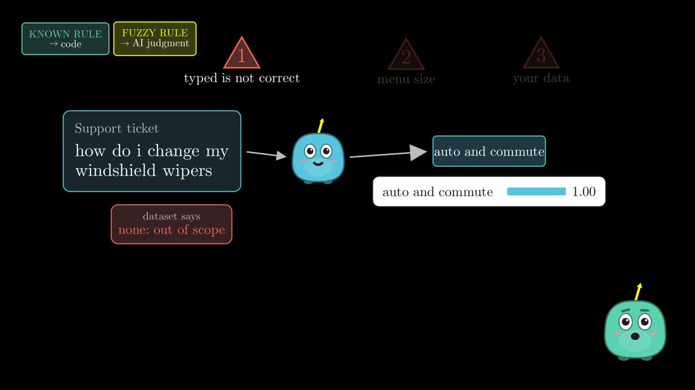<figcaption>A valid type is not a correct answer.</figcaption></figure>

- **Valid, but wrong.** "How do I change my windshield wipers" is labelled out of scope in CLINC150. Jev sent it to the auto agent, 100% sure. Typed output rules out *invalid* answers, not *wrong* ones; you still need thresholds and a fallback.
- **The size of the menu.** With 3 candidate intents Jev was right 98.5% of the time; with all 77, 83%. Shortlist first, then let Jev choose among a few.
- **Your data leaves your network.** It's a hosted API. For regulated data, a small local model may simply be the right call.

## The opening ticket, replayed

[▶ 11:23](#t=683)

<figure>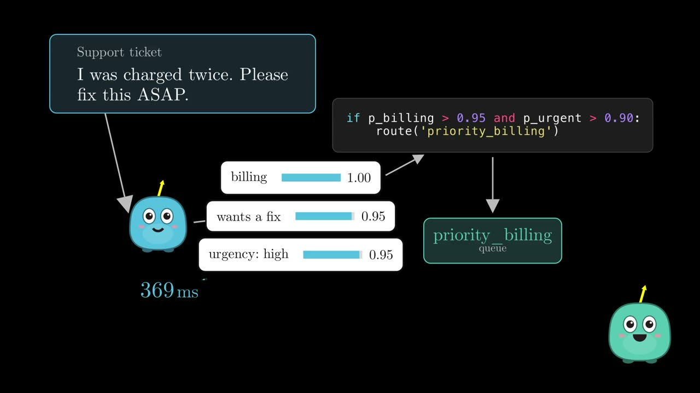<figcaption>Same ticket, now as decisions: 369 ms instead of 1.9 s.</figcaption></figure>

The same ticket, now as decisions: *what is it about? do they want it fixed? how urgent?* Billing 1.00, a fix 0.95, urgency high 0.95. Code checks the thresholds, and it lands in the priority billing queue, in under four tenths of a second.

> Why pay a model to write language, when the software only needed a decision? State in. A judgment out. Then code.

## Data and sources

1. TypeSafe, [*Introducing System One models and Jev*](https://typesafe.ai/blog/introducing-system-one-models-and-jev) (launch post, Sep 15 2026), and the [Python SDK](https://github.com/typesafe-ai/typesafe-sdk-python).
2. Vercel, [*AI Gateway: Jev model launch*](https://vercel.com/blog/ai-gateway-jev-model-launch) (Sep 18 2026).
3. S. Larson et al. *An Evaluation Dataset for Intent Classification and Out-of-Scope Prediction* (CLINC150). EMNLP 2019.
4. I. Casanueva et al. *Efficient Intent Detection with Dual Sentence Encoders* (BANKING77). NLP4ConvAI 2020.
5. D. Kahneman. *Thinking, Fast and Slow.* 2011.
6. Language-model baseline: Gemini 2.5 Flash. All the Jev calls in these experiments cost about nine cents in total.

## Read more on this site

- [Vectors in Depth, Part 1: How Vector Search Really Works](./vectors-in-depth-1.md): the animated series on vector databases, from embeddings to HNSW and filtered search.

Full transcript

**[0:00](#t=0) · Welcome**

Welcome! I'm a software and AI ML engineer, and I've spent the past ten years building at startups. That's my website: take a look for everything from this video. And this is Vee, our buddy, who'll help us learn along the way. This is part one of AI Systems in Depth. And today, we're looking at Jev: the AI model that refuses to talk.

**[0:22](#t=22) · One ticket, 1.9 seconds, fenced JSON**

A support ticket arrives: I was charged twice, please fix this ASAP. So we do what everyone does. We ask a large language model to classify it, and to return JSON only. It thinks for about a hundred tokens, writes its answer, and almost two seconds later, this comes back. Look at what that one answer took. It read forty-one tokens of prompt. Then it spent a hundred and fourteen hidden tokens, thinking to itself, and eleven more writing the reply. You pay for every token it generates: a hundred and twenty-five of them, to deliver one word. Once, that's a tiny fraction of a cent. For a million tickets a day, it's about three hundred and twenty-five dollars, every day. Notice the little markdown fence it added, even though we asked for JSON only. And inside all of that, the one thing our program actually needed: one word. Everything else gets thrown away: the tokens, the formatting, the JSON syntax, the parsing, the retries when it goes wrong. Which raises a slightly embarrassing question. What if the software never needed language at all?

**[1:25](#t=85) · The program only needed a branch**

Look at what the program does with that word. It doesn't need an essay. It needs a branch: if billing, send it to the billing queue. The branch itself is easy. The fuzzy part is deciding which way to go. So there are two different kinds of rule here. What to do after the decision is a known rule, and known rules belong in normal code. What the decision should be is a fuzzy rule, and that's the only part that needs AI judgment. Keep that split in mind. It runs through this whole video.

**[1:54](#t=114) · Meet Jev**

Now imagine a model built for exactly that part. You give it the state, a question, and the answers that are allowed. And instead of text, it hands back a decision, with a probability for every option. That model exists. In September 2026, a company called TypeSafe released Jev. It doesn't write paragraphs. It doesn't generate code. It doesn't stream an answer token by token. I sent it the same ticket: billing, with a probability of one, in about four tenths of a second. It speaks in three shapes. Choice: pick one option. Noul: how likely a yes-or-no statement is to be true. And Score: where something sits on an ordered scale.

**[2:38](#t=158) · Talk vs decide**

Here's the difference in one picture. A generative model builds its answer one token at a time. Then your code has to parse what it wrote. A decision model returns typed probabilities directly. One careful note. This is the difference we can see from the outside. It isn't a diagram of Jev's insides. TypeSafe hasn't published those. TypeSafe calls Jev a System One model. The name borrows from Daniel Kahneman: System One is fast, intuitive judgment; System Two is slow, deliberate reasoning. It's a product metaphor, not evidence that Jev works like a human brain.

**[3:14](#t=194) · Why people cared**

And the launch spread unusually fast. Jev launched on September fifteenth. Three days later, Vercel reported that within a day, nearly thirteen percent of paid teams on its AI Gateway had tried it. The fastest-adopted model in the gateway's history. But hype doesn't tell you what a thing is for. So in this video: what Jev actually is, where it fits, and where it breaks.

**[3:40](#t=220) · Criteria defined at runtime**

Jev's pitch is that the decision is defined at runtime. Same ticket, same model, but this time I sent it five different options: refund, duplicate charge, fraud, subscription, other. It picked duplicate charge, with a probability of one, in under four tenths of a second. So Jev isn't sold as one classifier for one taxonomy. It's sold as a general decision engine that judges whatever criteria you declare in the request. That's a claim about the interface, not proof of a new architecture: TypeSafe hasn't published Jev's internals.

**[4:17](#t=257) · Choice, Noul, Score**

Choice picks one option from a set, with a probability for each. Noul answers a yes-or-no question with the probability that the answer is yes. And Score places something on an ordered scale: low, medium, high. Now soften the ticket: I think I may have been charged twice, could you check when you get a chance. Still billing. But the chance they're asking for a fix drops to five percent, and urgency slides to medium. None of this is new mathematics. The claim is making probabilistic decisions the native product surface.

**[4:51](#t=291) · A probability becomes a code path**

So what is a decision model actually for? What does it let us build differently? Here's the first answer. A probability can become a threshold, and a threshold can become a code path. Above ninety-eight percent, refund automatically. Above seventy-five, ask for more context. Below that, send it to a human. And now the probability itself is part of the program.

**[5:18](#t=318) · Known rule? Write code**

Let's start with the easiest case. A customer's balance drops below zero. Do we charge an overdraft fee? That's one line of code. Sure, you could ask Jev: is this balance negative? But why pay for a guess, when you already know the answer exactly? So here's our first rule of thumb. Known rule? Write code.

**[5:39](#t=339) · The boring classifier that won**

Now a harder one: seventy-seven fixed banking intents, and ten thousand labelled examples to learn from. So I trained the most boring model I could think of: word counts, and a logistic regression. On the same thousand and one tickets, it got eighty-nine percent right. Jev, given only the label names? Seventy-nine. And the boring model runs on a laptop, in a fraction of a millisecond. It costs nothing per call, and your data never leaves the building. So when your labels are stable, and you have training data, a specialist classifier is a serious baseline. Don't pay for an API just because it's fashionable.

**[6:19](#t=379) · When the labels change every week**

But now, let the task change every week. This week: refund, bug, fraud. Next week: chargeback, duplicate, subscription, fraud. The week after, different rules for every country. With a trained classifier, every change means relabelling, and retraining. Again, and again. This is where Jev gets interesting. The answers are still a short list. The rule is fuzzy. The list changes at runtime, with no retraining. And the probability tells your code what to do next.

**[6:51](#t=411) · Open answers need a language model**

Now a very different request: explain to this customer why their refund was denied, and draft a reply that fits their history. Is there a list of allowed answers here? No. The answer is language, and the space of possible replies is astronomically large. This is Chatty's job, and Chatty is good at it. Deci can't write that explanation. None of its cards fit. And that isn't a flaw. It's simply outside the abstraction. Open answers? Use a generative model.

**[7:24](#t=444) · The decision map**

Now put all four on one map. Left to right: how exact the rule is. Bottom to top: how open the answer space is. Exact rule, bounded answers: code. Fuzzy and bounded, with stable labels and plenty of data: a classifier. Fuzzy and bounded, but the criteria keep changing: a decision model like Jev. Fuzzy and open: a generative model. The borders overlap. They're not walls. But if you remember one thing from this video, remember this. Use code when the rule is known. Use a decision model when the rule is fuzzy, but the answers are known. Use a generative model when the answers themselves are open. And if the task is stable, with plenty of labels, try a specialist classifier first. That's the map. Now let's watch Jev work in real systems.

**[8:14](#t=494) · An agent router: 4 decisions in one call**

Here's the example people are most excited about: an AI agent with a team of specialists. I took a public dataset, CLINC150, and turned its ten domains into ten agents: banking, travel, work, home, and so on. Plus one more door: none of the above. For every request, something has to pick the door. Ask Gemini, and it thinks first: about two hundred and eighty tokens, mostly hidden reasoning, just to write one agent's name. Two point two seconds. Ask Jev, and it simply picks: a third of a second. And when a request fit no agent at all, Jev said so three times out of four. Gemini, six times out of ten. But an agent doesn't make one decision per step. It makes several. Which agent? Does it need a human? How urgent is it? Is it just small talk? Jev answers all four in one call, in a third of a second. Gemini, asked four separate questions, took almost sixteen. Over a twenty-step run, that's seven seconds against five minutes. One agent feels instant. The other, you wait for.

**[9:19](#t=559) · A cheap gate before the big model**

One of the most plausible uses: put the cheap decision model in front of the expensive one. Simple, confident cases go straight to code. Only the ambiguous ones go to the big language model. The expected cost is the decision model's cost, plus the escalation rate times the big model's cost. With my real numbers, one Jev decision costs about four thousandths of a cent. One Gemini call costs about a tenth of a cent. If a third of the cases escalate, the average cost per ticket falls to roughly a third of always calling Gemini. The saving depends on how often you escalate. But the pattern is simple: a cheap judgment first, and the expensive model only when it's needed.

**[10:04](#t=604) · A guardrail around the LLM**

Now flip it around. Let the big model write the reply to a customer. Before it's sent, ask Jev one question: does this reply promise a refund? Here's a real draft: we are immediately processing a full refund. Ninety-nine percent. Hold it for review. And another: cash deposits usually take one to two business days. Two percent. Send it. I tested forty drafts, half told to promise a refund, half told not to. Jev sorted all forty correctly, in about a third of a second each. So Jev might be most useful not as the main model, but as the model around the main model.

**[10:42](#t=642) · Where it breaks**

So where does it break? First: a typed answer isn't a correct answer. In my router test, how do I change my windshield wipers is labelled out of scope. Jev sent it to the auto agent, a hundred percent sure. Valid type, wrong door. You still need thresholds and a fallback. Second: the size of the menu. With three candidate intents, Jev was right ninety-eight percent of the time. With all seventy-seven, eighty-three. So shortlist first, then let Jev choose among a few. And third: it's a hosted API, so your data leaves your network. For regulated data, a small local model may simply be the right call.

**[11:23](#t=683) · The opening ticket, replayed**

Back to the ticket we started with. At the start, we asked a language model to write something our program could parse. Now the program just asks for the judgments it needs. Three questions: what is it about, do they want it fixed, how urgent is it. Billing. Ninety-five percent. High. Code checks the thresholds, and it lands in the priority billing queue. In under four tenths of a second. So here's the question Jev leaves us with. Why pay a model to write language, when the software only needed a decision? State in. A judgment out. Then code.

**[11:58](#t=718) · Thanks**

Thanks for watching. If this helped, subscribe, and I'll see you in the next one.

