This is the first episode of **Vectors in Depth**, an animated series on how vector databases actually work. It starts from a single search in a fitness app and follows it all the way down: how meaning becomes geometry, how the HNSW graph finds the nearest points without looking at most of them, how that graph is built, and why a simple filter like "only dumbbell exercises" turns out to be the hardest part of the whole problem.

Every number in the video comes from real runs: 876 exercises embedded with Gemini (768 numbers each) in a local Qdrant, plus collections of 200,000 and 1,000,000 vectors for the benchmarks. Your guide is **Vee**, the series' mascot.

> [!TIP] The video in one minute
> Search by meaning becomes **finding the nearest points**. Checking every point is exact but grows with the data, so vector databases make a deliberate trade: **approximate search**. HNSW does it with a **layered graph**: long jumps on sparse upper layers, a careful search on the dense bottom one, tuned by three knobs (**ef**, **ef_construct**, **m**). Then filters arrive, and they can break the graph's roads. Qdrant answers with **payload indexes**, a **query planner** that picks a strategy per query, **filter-aware links**, and **ACORN** for strict combinations.

Below is a written walk through the video, section by section. Click any timestamp to jump the player to that moment.

## One search, two questions

[▶ 0:16](#t=16)

You type into a fitness app: *find exercises similar to a Bulgarian split squat, that I can do at home, with dumbbells.*

<figure>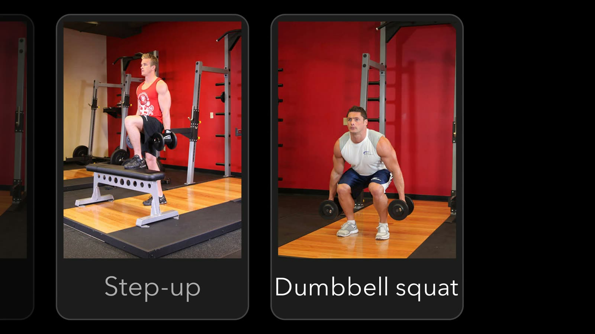<figcaption>The results look like a perfectly normal search. They are not.</figcaption></figure>

Part of that query is ordinary: "at home" and "with dumbbells" are **filters**. A filter asks a yes-or-no question about every row, and any database answers it with one line of SQL.

"Similar to a Bulgarian split squat" is different. Similar how? The same muscles, the same movement, the same effort? There is no column for that, and similarity is not a yes or a no. A lunge is very similar to a split squat, a step-up a little less, a bench press hardly at all. **Searching by meaning needs a number: how similar?**

## Meaning becomes geometry

[▶ 1:35](#t=95)

Scatter every exercise on a table, then move them so that similar ones sit close together. Running, jogging and cycling drift together; push-ups find the bench press; the lunge, the step-up and the split squat end up side by side. Nobody told the cards what they mean, yet **position itself now carries meaning**.

<figure>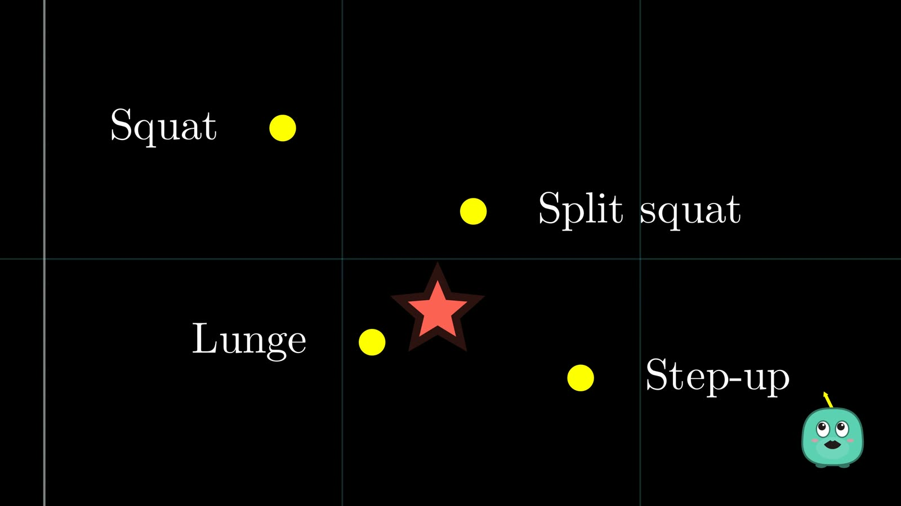<figcaption>Every exercise gets an address, and the query is just another point. Search becomes: which points are closest?</figcaption></figure>

Lay a grid under the map and every exercise gets an address. Drop the query where its meaning puts it, and "what means something similar?" becomes a much simpler question: **which points are nearest?**

The addresses come from a model. That list of numbers is an **embedding**. Two numbers was a cartoon: the model used here writes **768 numbers** for every exercise, and models like Sentence-BERT are trained so that similar things land close together. No single number means "leg exercise"; what matters is where the whole list lands, and what lands near it. Drag the query around and the nearest neighbours change with it: that, in one picture, is vector search.

## Exact search, and why it does not scale

[▶ 3:52](#t=232)

The simplest algorithm is almost embarrassingly simple: compare the query with every exercise, sort by distance, keep the closest. With twelve exercises, that is twelve comparisons.

<figure>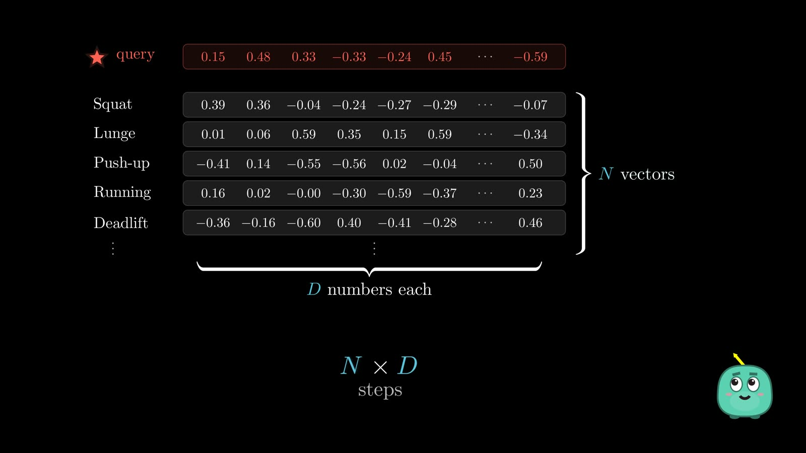<figcaption>Exact search touches every vector: about N × D steps for every query.</figcaption></figure>

But real apps hold millions of things, and exact search has to ask every single one. N vectors of D numbers each cost about **N × D** steps. A million vectors of 768 numbers is **768 million multiply-adds for a single search**. SIMD, GPUs and optimised libraries make each step faster, but the work still grows with every vector you add.

## The bargain: approximate search

[▶ 5:06](#t=306)

Can we find the nearest points without looking at every point? Not if we insist on certainty: a guarantee means ruling out every point that could be closer. So search engines make a different deal, **approximate nearest-neighbour search (ANN)**: look at a small fraction of the points, accept a small risk of missing the perfect answer, and get an excellent one much faster. It is not a broken exact search. It is a deliberate trade.

Checked on the real collection of 876 exercises in Qdrant, the exact and the approximate top five came back **identical, down to the last decimal**. With 200,000 vectors the exact scan took about a millisecond per query and the approximate search about a quarter of that. With five times the data, the exact scan got 3.5 times slower, the approximate one not even twice, and it still found nearly all of the true top ten.

## A map of neighbours, and the local trap

[▶ 6:56](#t=416)

Which points should we look at? Picking twenty at random fails: twenty random picks contain the true nearest only about one time in ten. We need *promising* points.

So give every exercise a few nearby neighbours. With 183 exercises, linking everything to everything would take over sixteen thousand links; three neighbours each needs fewer than four hundred. The points now form a **neighbour graph**, and searching becomes navigating: look at your neighbours, step to the closest, stop when nobody is closer.

<figure>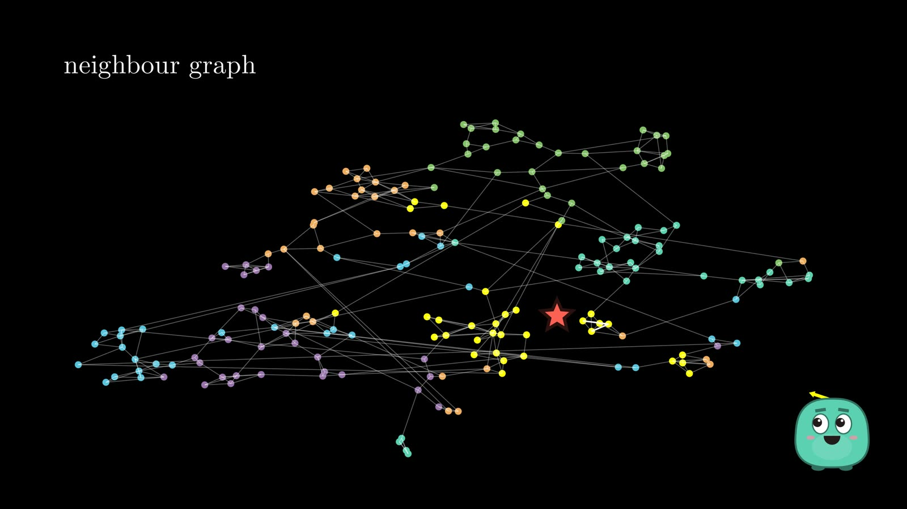<figcaption>A neighbour graph: each exercise knows a few others nearby.</figcaption></figure>

From the Medicine Ball Chest Pass, the walk reaches the right answer in a handful of hops (the distance falls 0.354, 0.307, 0.251, 0.195), checking only 13 of 183 exercises. But start at the Plank and the walk stalls: every neighbour is farther from the query, and reaching the answer would mean first moving away. The HNSW paper calls this being stuck in a *distant false local minimum*. The fix is not a smarter walk. It is a better map.

## Small worlds and shortcuts

[▶ 8:34](#t=514)

In the 1960s, Stanley Milgram asked people in Nebraska to pass a letter to a stranger in Massachusetts, only through people they knew on a first-name basis. The letters that arrived took between five and six steps. As Jon Kleinberg later showed, people using only local knowledge can find short paths, because most of your friends live near you but a few live far away. **Short links give precision; long links give reach.**

<figure>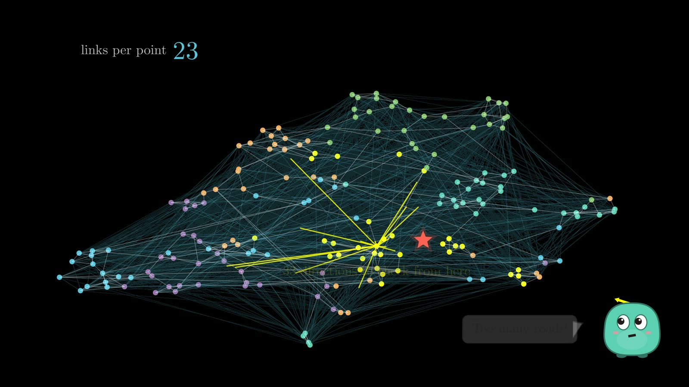<figcaption>Add shortcuts everywhere and every stop has dozens of roads to check.</figcaption></figure>

Add a few "highways" and the walk from the Plank crosses straight to the answer in three hops. But add too many, and every stop has dozens of directions to check: each search looks at sixty points instead of ten, and still finds the true nearest only two times in three. Mixing every scale into one graph rebuilds the original problem.

## Layers: the idea behind HNSW

[▶ 10:19](#t=619)

The answer comes from a 1990 idea for sorted lists: William Pugh's **skip list**, which adds express lanes above an ordinary list. Vectors have no order, only distance, so HNSW swaps "move right" for "move closer". Every exercise lives on the bottom layer with short local links; a few are lifted to a layer above with longer links, and a handful to the very top.

<figure>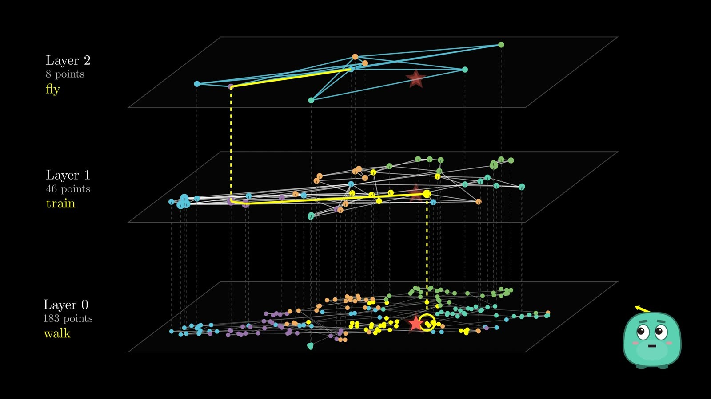<figcaption>Fly on the sparse top layer, take the train in the middle, walk the last streets on the bottom.</figcaption></figure>

It is like visiting a friend in another country: fly to the right city, take a train to the right neighbourhood, walk the last few streets. **H**ierarchical (the layers), **N**avigable (a greedy walk works), **S**mall **W**orld (short links plus a few long ones). On the toy map a greedy version still misses sometimes; Qdrant's version keeps several candidates alive, which is why it found **99.6%**.

## Who lives upstairs, and where search starts

[▶ 11:15](#t=675)

Who gets promoted to the upper layers? Nobody decides. **Every new vector rolls dice** for its top floor. Being upstairs does not make an exercise better; it just makes it a crossroads. The chance of reaching each next floor falls fast, so each floor is about sixteen times emptier than the one below. Roll it for a million vectors and about 58,000 reach the first floor, a few thousand the second, a couple of hundred the third, and exactly one sits at the top.

A query starts at that top **entry point**, which can be nowhere near the query. That is fine: the top layer's only job is to get into the right part of the world. It moves greedily until no neighbour is closer, then carries that point one floor down to start again. No floor has to find the final answer; each one only hands the next, denser floor a better place to start.

## Searching the bottom layer: the frontier and ef

[▶ 12:46](#t=766)

At the bottom the search stops being purely greedy, because a branch that looks worse now can lead somewhere better two hops later. It keeps **two lists**: points *to explore*, and the *best found* so far.

<figure>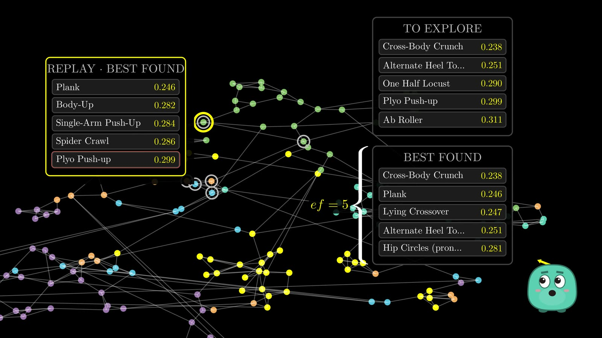<figcaption>Always expand the most promising unexplored point, but never forget the other branches.</figcaption></figure>

The best-found list has a size limit, **ef**. When it is full and a better point arrives, the worst falls out. The search stops when the best unexplored point is worse than everything it is keeping. For the query "a core exercise lying on the floor, without equipment", ef = 2 checked six exercises and returned the wrong answer; ef = 8 checked twenty-eight and found the true best, Bottoms Up.

**ef is not how many results you get back** (that is k, the limit). ef is how widely the search explores while looking for them; in Qdrant it is `hnsw_ef`, settable on every query.

## Recall: did the wider search help?

[▶ 15:55](#t=955)

Compare with the exact answer. **Recall@k** is the share of the true top k that came back: with ef 5, four of the true top five (recall 0.8); with ef 16, all five.

<figure>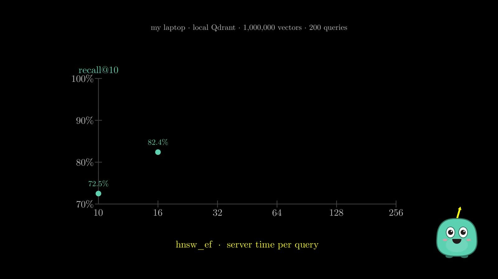<figcaption>Recall against time per query, measured on a million vectors in Qdrant.</figcaption></figure>

On a million vectors in Qdrant: **ef 10 found 72%** of the true top ten, **64 found 98.5%**, **256 found all of them**, and each step cost a little more time. Wider generally means better, but never for free.

## How the graph is built

[▶ 16:55](#t=1015)

Vectors do not arrive with links attached, and rebuilding the graph for every insert would defeat the point. So each new vector is added **incrementally**. It rolls its level, then **uses the graph to extend the graph**: it runs a search from the top entry point to find its region, exactly like a query.

Where it needs links, it runs a more careful search for a pool of candidates. The size of that pool is **ef_construct**. A graph built with a pool of 4 found the true nearest 42% of the time on the map; with 16, 76%.

<figure>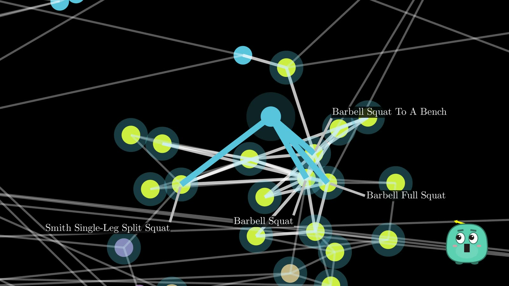<figcaption>Diverse neighbours: skip a candidate that an already-kept neighbour covers.</figcaption></figure>

Which candidates become links? "The four closest" picks four barbell squats, all pointing the same way. HNSW uses a rule of thumb instead: **keep a candidate only if it is closer to the new point than to every neighbour already kept**. That spreads links in different directions; on the map, graphs built this way found the true nearest 76% of the time against 65% for closest-four.

<figure>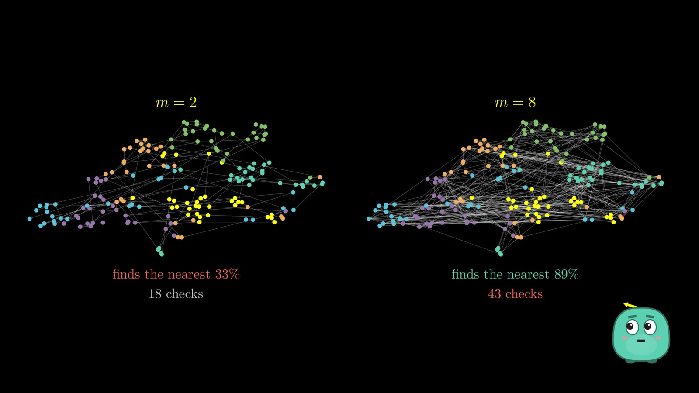<figcaption>m is the connection budget: more routes, more cost.</figcaption></figure>

**m** caps how many links each point may keep. m = 2 found the true nearest a third of the time; m = 8, nine times in ten, but each search checked 43 exercises instead of 18 and the graph held nearly three times as many links. Links go both ways, so a neighbour that overflows its budget re-chooses its own links with the same rule. And occasionally a new vector rolls higher than the whole graph and becomes the new entry point.

Real Qdrant builds on 200,000 vectors: **ef_construct 16** built in three seconds and found **92%** of the true top ten; **100** took five seconds and found **99%**; dropping **m to 4** found **70%**. Two knobs at build time (ef_construct, m), one at query time (ef).

## One filter breaks the picture

[▶ 21:48](#t=1308)

Back to the original query: *only dumbbell exercises*. Colour them green: 22 of 183. Everything else fades, and what is left falls into **four separate islands**. Even the entry point is not a dumbbell exercise.

<figure>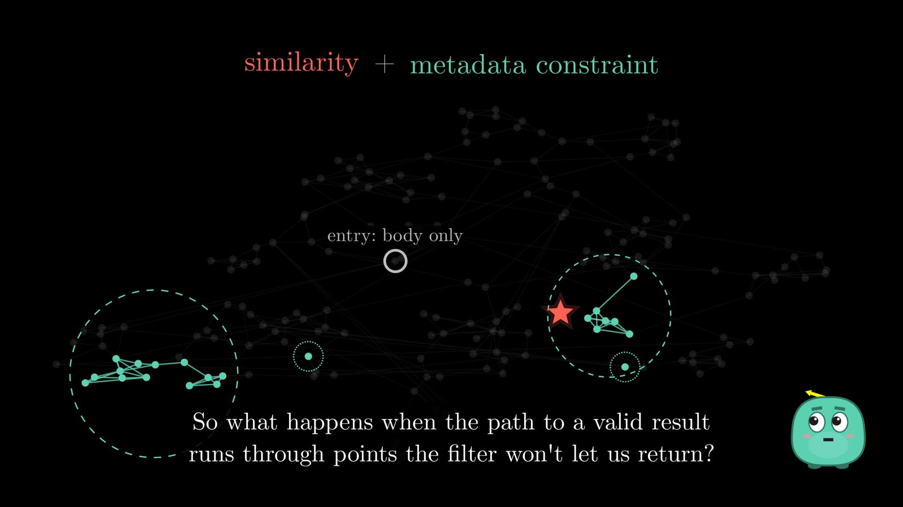<figcaption>The graph was built for similarity. The filter does not care about any of that.</figcaption></figure>

The graph's links join exercises that mean something alike. The filter asks a completely different question: is this one allowed? And the best route through meaning may run through exactly the points the filter rejects.

## Search then filter, or filter first?

[▶ 22:37](#t=1357)

**Post-filtering**: search normally, then throw away what fails the filter. Ask for five, and **one** survives. The next valid answers sit at ranks 18, 41, 49 and 54: the top five overall is not the top five of what is allowed.

<figure>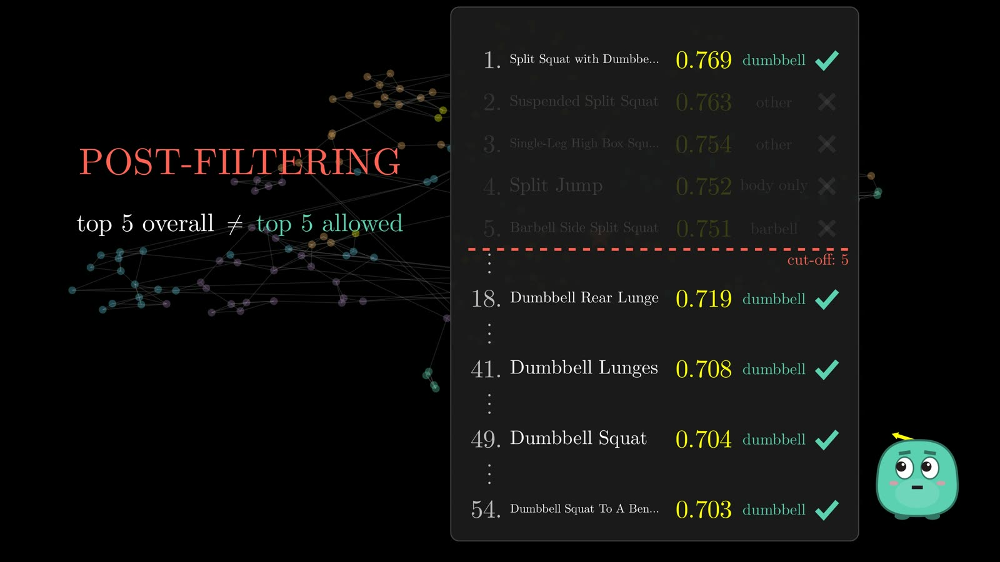<figcaption>Post-filtering: requested five, returned one.</figcaption></figure>

**Filter first** puts the filter inside the query. How well it works depends on scale. On a million vectors, if only 40 survive, just compare the query with those 40: **brute force is the optimisation**, a tenth of a millisecond. If 620,000 survive, checking them all takes almost four milliseconds, the very problem the graph was invented to avoid.

## Cardinality, payload indexes and the planner

[▶ 23:53](#t=1433)

The hidden variable is the filter's **cardinality**: how many points survive. Every Qdrant point carries its metadata as **payload**, and a field you filter on gets a **payload index**, one list of ids per value. That lets Qdrant estimate a filter's size without touching the vectors: 123 dumbbell exercises, exactly.

Then the **query planner** decides per segment of data. 40 estimated matches: an exact scan, a tenth of a millisecond, perfect recall. 620,000: walk the graph, seven tenths of a millisecond instead of four, still finding 98% of the true top ten.

## When filters break the graph

[▶ 25:09](#t=1509)

The hard case is the middle: too many survivors to scan, but enough removed that the graph starts to break. Start from a dumbbell curl, allowed to step only on dumbbell exercises, and the search gets stuck on a preacher curl, far from the split squat. **The roads disappeared.**

<figure>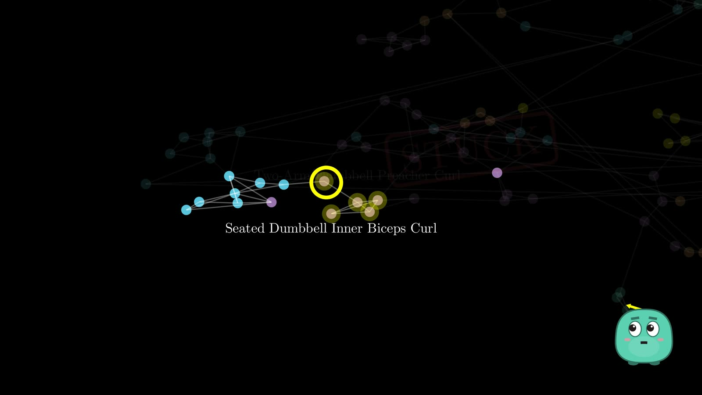<figcaption>The target did not move. The query did not move. The roads disappeared.</figcaption></figure>

In Qdrant, on 200,000 vectors with a filter keeping 4%, ordinary graph search found **less than 1%** of the true top ten, and raising ef from 16 to 256 still found less than 1%. Searching harder and having roads are different problems.

## Filter-aware links

[▶ 26:21](#t=1581)

So Qdrant changes the graph. When a field has a payload index, it adds **extra links among points that share a value**, so routes survive when the search is limited to them. With the index in place before the data arrived, the same filter found **89%** at the lowest setting and **99.5%** at an ef of 64.

That explains a piece of advice that otherwise looks arbitrary: **create the collection, create the payload index, then upload the vectors**. Add the index after the graph is built, and the extra links do not appear until the index is rebuilt. Your payload schema shapes the graph itself.

## Combined filters and ACORN

[▶ 27:22](#t=1642)

Stack rules (dumbbells, beginner level, trains the quadriceps) and only four of 876 exercises are left. Links were built per field, and nobody can precompute a graph for every combination: a two-field filter keeping half a percent found only 45% at the lowest setting.

<figure>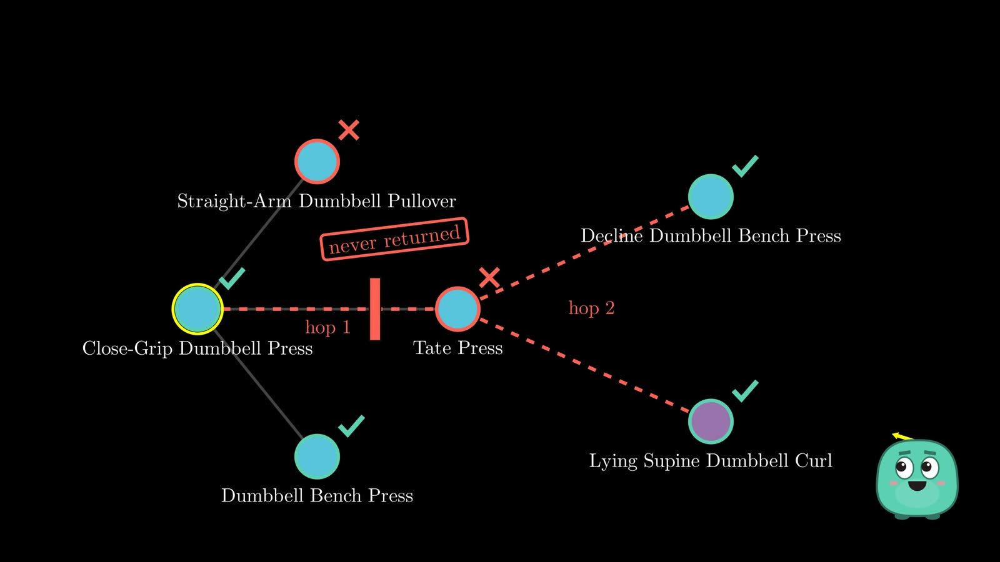<figcaption>ACORN: look through a blocked neighbour at its own neighbours.</figcaption></figure>

**ACORN** (Stanford and Berkeley, 2024) never returns a blocked point, but it **looks through it** at its neighbours, one extra hop used only when the direct ones are filtered out. In Qdrant it is one option on the query and switches on only when the filter keeps less than 40% of the points. On the compound filter, recall went from **73% to 100%**, at 3.7 ms instead of 0.2: more work, for the hard cases.

Filtered vector search is not one algorithm. **It is a planning problem.**

## Qdrant in real code, and tuning

[▶ 29:16](#t=1756)

Underneath all of it, a Qdrant point is simple: an id, a vector and a payload. The vector says what is similar; the payload says what is allowed; the indexes decide how much of the database to look at. The whole query is one call:

<figure>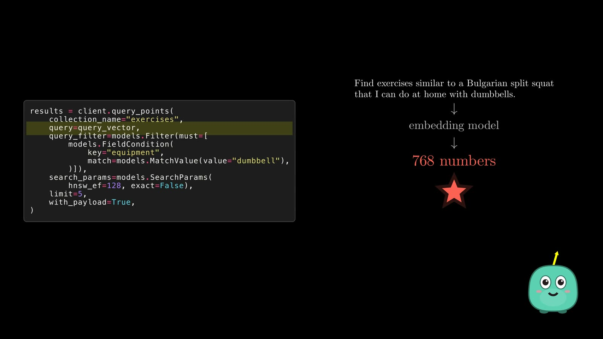<figcaption>The whole search as one real call.</figcaption></figure>

```python
results = client.query_points(
    collection_name="exercises",
    query=query_vector,                                  # the sentence, as 768 numbers
    query_filter=models.Filter(must=[
        models.FieldCondition(key="equipment", match=models.MatchValue(value="dumbbell")),
    ]),                                                  # which points are eligible
    search_params=models.SearchParams(hnsw_ef=128, exact=False),   # how widely to explore
    limit=5,                                             # k, not the same as ef
    with_payload=True,                                   # bring back the facts
)
```

[▶ 30:10](#t=1810) The tuning recipe from the video:

- Run the **exact** search once as ground truth and measure recall against it. On a million vectors, ef 8 returned four of the true five (recall 0.8); ef 128 returned all five, at half a millisecond instead of a sixth.
- **Recall too low?** Raise ef. If that fixes it, the graph was fine. If not, the graph is the ceiling: rebuild with a higher m or ef_construct.
- **Too slow?** Lower ef until you reach the recall you can live with.
- **Filtered queries slow or incomplete?** Check that the fields are indexed, how many points the filter leaves, and which strategy Qdrant is likely to pick.

The goal is not maximum recall at any cost. It is **enough recall for the latency budget your app can afford**.

## The whole picture

[▶ 31:53](#t=1913)

Embeddings and similarity are **geometry**. The graph is how we **skip most of the space**. Payload and filters are **exact rules**. And the planner **chooses the strategy**. A vector database exists to manage those trade-offs.

> The vector is the easy part. The hard part is deciding which vectors you don't need to look at. And once business rules arrive, the harder part is knowing which shortcuts still work.

Part 2 and beyond will cover hybrid search, quantization, distributed search and reranking.

## Papers and sources

1. Y. Malkov, D. Yashunin. [*Efficient and robust approximate nearest neighbor search using Hierarchical Navigable Small World graphs*](https://arxiv.org/abs/1603.09320).
2. J. Kleinberg. *The Small-World Phenomenon: An Algorithmic Perspective.* STOC 2000.
3. N. Reimers, I. Gurevych. [*Sentence-BERT*](https://arxiv.org/abs/1908.10084). 2019.
4. L. Patel, P. Kraft, C. Guestrin, M. Zaharia. [*ACORN: Performant and Predicate-Agnostic Search Over Vector Embeddings and Structured Data*](https://arxiv.org/abs/2403.04871). 2024.
5. Exercises and photos: [free-exercise-db](https://github.com/yuhonas/free-exercise-db) (public domain).
6. Qdrant documentation: [indexing](https://qdrant.tech/documentation/manage-data/indexing/) and [search](https://qdrant.tech/documentation/search/search/).

## Read more on this site

- [HNSW, From the Ground Up](../writings/hnsw-from-the-ground-up.md): the same algorithm in writing, with measured numbers from a 200,000-vector index.
- [Chapter 22 of the RAG book: Vector Search Internals](../books/rag-first-principles/part8-deep-dives/22-vector-search-internals.md): HNSW built from scratch in Python, IVF, quantization and filtered search.

<details>
<summary>Full transcript</summary>

**[0:00](#t=0) · Welcome**

Welcome! I'm a software and AI and ML engineer, and I've spent the past ten years building at startups. That's my website: take a look for everything from this video. And this is Vee, our buddy, who'll help us learn along the way. This is part one of Vectors in Depth.

**[0:16](#t=16) · One search, two questions**

Say you type this into a fitness app: find exercises similar to a Bulgarian split squat, that I can do at home, with dumbbells. You hit enter, and the results come back. It looks like a perfectly normal search. Split squats, lunges, step-ups. And some of it really is normal. At home, with dumbbells. That's just a filter. Any database can answer it, with one line of SQL. But this part isn't. Try writing it in SQL, and you get stuck... right here. Similar how? The same muscles? The same movement? The same effort? There's no column for that. A filter asks a yes-or-no question about every row. Does this exercise use dumbbells? Yes. Yes. No. No. But similar isn't a yes or a no. A lunge is very similar to a split squat. A step-up, a little less. A bench press? Hardly at all. Similarity is a sliding scale, from not at all... to almost the same. So instead of yes or no, we need a number. How similar?

**[1:35](#t=95) · Meaning becomes geometry**

On that line, closeness meant similar. Let's push that idea further. Take every exercise in our database, scattered in no particular order. Now let's move them, so that similar exercises sit near each other. Running, jogging and cycling drift together. Push-ups find the bench press. And the lunge, the step-up and the split squat end up side by side. Nobody told the cards what they mean. But look: position itself now carries meaning. Close together means similar. Far apart means different. Let's make that precise. Lay a grid under the map, and every exercise gets an address: two numbers. The squat lives here. The split squat, right next door. And running, all the way across the map. If similar things live close together, then search becomes a geometry problem. Here's our query. We drop it wherever its meaning puts it: right among the leg exercises. So instead of asking what means something similar, we ask a much simpler question: which points are closest? So where do these addresses come from? A model writes them. Show it a split squat, and out come two numbers. A lunge? Numbers close by. Running? Very different ones. That list of numbers is called an embedding. Two numbers was a cartoon. Real embeddings are much longer: this model writes seven hundred sixty-eight numbers for every exercise. And this is exactly what modern models are trained to do. Sentence-BERT, for example, makes semantically meaningful embeddings, so that similar sentences end up close. But don't try to read any single number: number two hundred twelve doesn't mean 'leg exercise'. What matters is the whole list: where it lands on the map, and what lands near it. Now the fun part. Let's grab the query and move it around. The nearest points update as we go: lunge, split squat, step-up. Drag it toward cardio, and the answers change with it: jogging, running, cycling. Down toward the pushing exercises? Push-ups and presses. That, in one picture, is vector search: turn the question into a point, and return whatever is nearest.

**[3:52](#t=232) · Exact search: ask every point**

And the algorithm behind it is almost embarrassingly simple. Compare the query with every exercise, sort them by distance, and keep the closest three. With twelve exercises, that's twelve comparisons. Easy. But real apps don't hold twelve things. A hundred. Ten thousand. A million. A hundred million. There's just one small problem. To know which point is nearest, this simple method has to ask every single one. Let's count. N vectors, each with D numbers. Checking them all takes about N times D steps. A million vectors, seven hundred sixty-eight numbers each: that's seven hundred sixty-eight million multiply-adds. For a single search. Computers are surprisingly good at this. SIMD, GPUs and optimized libraries help enormously. But the work still grows with every vector you add. So here's the problem I actually want to solve. Can we find the nearest points without looking at every point? It turns out we can. Some graph algorithms barely slow down as the data grows. Let's find out how.

**[5:06](#t=306) · The bargain: approximate search**

Can we find the nearest points without looking at every point? There's an uncomfortable answer: not if we insist on being certain. If I need a guarantee that this is the closest point, then I have to rule out every point that could be closer. But search engines usually make a different bargain. What if we look at only a small fraction of the points, accept a small risk of missing the perfect answer, and get an excellent one, much faster? That's approximate nearest-neighbour search, or ANN. It isn't a broken exact search. It's a deliberate deal: less work, a little less certainty. Let's check that on something real. This is my local Qdrant, holding all eight hundred seventy-six exercises, embedded with Gemini. I ask the same question twice: once with exact set to true, once the default, approximate way. The top five come back identical, down to the last decimal. With two hundred thousand vectors, the exact scan took about a millisecond per query, and the approximate search about a quarter of that. Now five times the data: the exact scan got three and a half times slower, the approximate one not even twice. And it still found nearly all of the true top ten. But this only moves the problem. Which points should we look at? First, let's make the points real: these are a hundred eighty-three of our exercises, placed so that similar ones sit together. The obvious shortcut is to skip most of them. Pick twenty at random, and keep the best of those. The best one we sampled is a Floor Glute-Ham Raise, at a distance of 0.299. The real nearest, Split Squat with Dumbbells, sits right next to the query at 0.195. Twenty random picks contain it only about one time in ten. Fewer points was never the goal. We need promising points, and a way to decide where to look next.

**[6:56](#t=416) · A map of neighbours and the local trap**

Suppose every exercise knew just a few others nearby. Take Dumbbell Lunges. Its three nearest neighbours are the Rear Lunge, the Split Squat and the Dumbbell Squat. Do the same for every exercise, but don't connect everything to everything. With a hundred eighty-three points, that would be over sixteen thousand links. Three neighbours each needs fewer than four hundred. Now these vectors aren't just a pile of coordinates anymore. They form a map: a neighbour graph. If this is a map, then searching is navigating. Start somewhere far from the query, say at Medicine Ball Chest Pass. Don't compare the query with everything. Only with this node's neighbours. Move to whichever one is closer and repeat. Each hop, the distance drops: 0.354, 0.307, 0.251, and 0.195. Now no neighbour is any closer. Here's the whole algorithm. It really is this short: look at your neighbours, step to the closest, stop when nobody is closer. Notice what didn't happen. We checked thirteen of a hundred eighty-three exercises, and most of the map was never touched. This looks almost too easy. And it is. Same query, same map, but start at the Plank. The walk improves: 0.366, 0.356, and then it stops. From here, every neighbour is farther from the query. Yet the true answer, at 0.195, is over there, and reaching it would mean first moving away. A greedy walk never does that. And this isn't bad luck: on this map, from most starting points, the walk gets stuck. The paper behind this algorithm calls this being stuck in a distant false local minimum. And the fix isn't a smarter walk. It's a better map.

**[8:34](#t=514) · Small worlds and shortcuts**

In the nineteen sixties, a psychologist named Stanley Milgram tried something strange. People in Nebraska got a letter for a stranger in Massachusetts, with one rule: pass it only to someone you know on a first-name basis. Hand to hand, friend to friend, the letters that arrived took between five and six steps. Six degrees of separation. And nobody had a map. Everyone knew only their own friends, yet, as Jon Kleinberg put it, people using only local information were very effective at finding short paths. Why? Because most of your friends live near you, but a few live far away. Maps work the same way: neighbourhood streets, main roads, highways. So let's give our map a few highways and start again from the trap. This time the walk takes a highway straight across, to the Lunges, then the Split Squat, in three hops. Short links give precision. Long links give reach. So the answer is simple: add more shortcuts. And more. And more. Now every stop has dozens of directions to check. Each search now looks at sixty points instead of ten, and it still finds the true nearest only two times in three. We wanted to avoid looking everywhere, and we just rebuilt the same problem inside the graph. So instead of mixing every scale into one graph, what if we kept them apart? This problem was solved in nineteen ninety, for a simpler kind of data: a sorted list of numbers. To find six, a plain list walks one step at a time. William Pugh's skip list adds express lanes: some numbers get a copy one level up, fewer still on the next. Start at the top, ride far, drop down, and finish on foot. But a skip list needs an order: is the next number bigger than mine? Vectors have no order. They only have distance. So swap move right for move closer.

**[10:19](#t=619) · Layers: the idea behind HNSW**

Keep every exercise on the bottom layer, with its short local links. Lift a few of them to a layer above, linked across longer distances, and a handful to the very top. It's like visiting a friend in another country: you fly to the right city, take a train to the right neighbourhood, and walk the last few streets. Now search. Travel far while the map is coarse, drop down, close in, and on the bottom layer, one last look around. Split Squat with Dumbbells, after checking twenty exercises. Hierarchical: the layers. Navigable: a greedy walk works. Small world: short links, plus a few long ones. HNSW. On this little map it's still greedy, so it misses sometimes. Qdrant's version keeps several candidates alive, and that's why it found ninety-nine point six percent. And it's what my Qdrant built for those exercises, without being asked. But one question is hiding in this picture: who gets to live upstairs?

**[11:15](#t=675) · Who lives upstairs, and the entry point**

Look at this picture again. There's something suspicious about it. Every exercise lives down here, on the bottom layer. Forty-six of them also have a copy one floor up. And just eight make it all the way to the top. So who gets promoted? This algorithm doesn't sit down and decide which exercises deserve to be highway intersections. It rolls dice. Every new vector rolls once, for its top floor. Middle Back Shrug rolled a two: it lives on all three layers. Dumbbell Lunges rolled a zero: it lives only at the bottom. And being upstairs doesn't make an exercise better. It just makes it a crossroads. Randomness sounds like an odd choice. Why not pick the most important vectors? Because we don't need important vectors. We need different scales. If the chance of reaching each next floor falls fast, every floor automatically becomes much sparser than the one below: many, fewer, far fewer. The rule is one line: a random number, its negative log, scaled. You don't need to remember it. Its only job is to make each floor about sixteen times emptier than the one below. Roll it for a million vectors: about fifty-eight thousand reach the first floor, a few thousand the second, a couple of hundred the third, and exactly one sits at the top. So where does a query start? Not on the bottom layer: that would throw away the whole reason we built the hierarchy. It starts at the top, from an entry point. And that entry point can be nowhere near the query. That's okay. The top layer isn't trying to find the answer. Its job is to get us into the right part of the world.

**[12:46](#t=766) · Searching down the layers**

Up here, the algorithm does something surprisingly simple. Look at the connected neighbours. If one is closer to the query, move there. From Incline Push-Up Close-Grip, at 0.351, Middle Back Shrug is closer: 0.334. Move. Now none of its neighbours up here is any closer. So we're done. Not done with the search: done with this floor. Take that same exercise one floor down, where there are more exercises, and correct a little more: 0.325, 0.195. No floor has to find the final answer. It only has to hand the next, denser floor a better place to start. Coarse navigation, a better region, then a precise search. Let's ask something harder: a core exercise I can do lying on the floor, without equipment. The upper floors hand us the Plank, at 0.246. Stay greedy at the bottom, and every neighbour of the Plank is farther away, so the walk would stop right there. But the true best, Bottoms Up, is at 0.229. Down here we actually care about the answer. A branch that looks worse now can lead somewhere much better, two hops later. So at the bottom, the search stops being purely greedy. It keeps several possibilities alive.

**[13:59](#t=839) · The frontier and ef**

It keeps two lists. To explore: points we've found but haven't looked around yet. And best found: the strongest answers so far. Both start with the Plank. Look around the Plank. Four neighbours, all a little worse, but they all go into both lists. Now expand the most promising one we haven't explored: Body-Up. And keep going, always expanding the best unexplored point: Spider Crawl, then Hip Circles, then the Lying Crossover, at 0.247, and then Cross-Body Crunch, 0.238, better than where we started. Always expand the most promising point, but never forget the other branches. Best found has a size limit. The paper calls it ef: the size of the dynamic candidate set. Here, ef is five. When the list is full and a better point arrives, the worst one falls out. Single-Arm Push-Up comes in at 0.284, and Ab Roller, at 0.311, is dropped. So when does it stop? The best point we haven't explored is at 0.290. The worst one we're keeping is at 0.247. The best thing left to explore is already worse than everything we keep. Going further can't improve the list, so we stop. Bottoms Up, 0.229: the true best, after checking twenty-eight exercises. Now run the same query twice. Same graph, same entry point. Only one thing changes: ef two, and ef eight. With two, the list is so short the search barely leaves the Plank: six exercises checked, the wrong answer. With eight, more routes stay alive: twenty-eight checked, and Bottoms Up. And ef isn't how many results you get back. That's k: how many neighbours you ask for. ef is how widely the search explores while looking for them. In Qdrant it's called hnsw_ef, and you can set it on every query.

**[15:55](#t=955) · Recall, and the whole query**

So how do we know the wider search actually helped? Compare with the exact answer. With ef five, four of the true top five come back: recall at five is 0.8. With sixteen, all five come back: recall is one, for a little more work. Same experiment on my laptop, with a million vectors in Qdrant: an ef of ten finds seventy-two percent of the true top ten, sixty-four finds ninety-eight and a half, two hundred fifty-six finds all of them, and each step costs a little more time. Wider generally means better, but never for free. So every query has two personalities. Up here: be aggressive. One direction, move fast. Down here: be careful. Keep several good options alive. The hierarchy gets us into the right neighbourhood. The search at the bottom does the careful work. And out come the top k. But everything we've seen assumes this beautiful graph already exists. So who built it?

**[16:55](#t=1015) · How the graph is built**

Everything we've done assumes this graph was already here. But vectors don't arrive with links attached. Say the database gets one new exercise: an Elevated Back Lunge. Link it to random points? To everyone? Rebuild the whole graph? Rebuilding would defeat the point. So the algorithm adds it incrementally. Where should its links go? First, one strange decision: the new point rolls its level. It rolls a one. So it will live on Layer 1 and Layer 0, and nowhere above. That leaves two problems: find the right region, and choose useful neighbours. First, the region. Here's the elegant part. To build the graph, the algorithm uses the graph. The new point plays the role of a query, starting from the entry point at the top. On Layer 2 nothing is closer than the entry itself, so it drops straight to Layer 1: the index searches itself to figure out how to extend itself. Above its level, routing was all it needed. Now it has reached a layer where the new point actually needs links. Which existing exercises should become its neighbours?

**[17:56](#t=1076) · ef_construct and diverse neighbours**

The first points it bumps into aren't necessarily the best ones to link to forever. A permanent link will be used by every future search. So insertion deserves a careful search: a whole pool of candidates, found the way a query finds its best. How wide should that search be? That's ef_construct: the size of the candidate pool while building. With four, the pool holds four exercises. With sixteen, sixteen. Either way it may keep only four links. So the pool isn't the number of links. And look at the small pool: all four are squats covered by the first one, so it ends up keeping just one link. On our map, a graph built with a pool of four finds the true nearest forty-two percent of the time; with sixteen, seventy-six. A better graph, for more build work. The obvious rule: keep the four closest candidates. For our lunge that's four barbell squats. And look where they point: all the same way. If every road out of a city heads east, how useful is the fourth eastern road? Distance isn't the only thing that makes a link useful. The algorithm uses a rule of thumb: skip a candidate that an already-kept neighbour covers. Keep Barbell Squat. The next one, Barbell Squat to a Bench, is closer to Barbell Squat than to our lunge, so it's redundant: skip. Lunge Sprint points somewhere else: keep it. The final four: Barbell Squat, Lunge Sprint, Single-Leg High Box Squat and Landmine one-eighty. Spread out. The paper's own picture shows the same idea: a link to the other cluster that the closest-four rule would never make. Here's that rule as code, the version I ran. One line does the work: keep a candidate only if it's closer to the new point than to every neighbour already kept. On our map, graphs built this way find the true nearest seventy-six percent of the time; with the closest-four rule, sixty-five.

**[19:49](#t=1189) · m, pruning and a new top**

One more constraint: how many links is each point allowed to keep? That's m: the connection budget. A small m: a sparse graph, few routes. A large m: more routes around every obstacle. On our map, m two finds the true nearest a third of the time; m eight, nine times in ten, but each search checks forty-three exercises instead of eighteen, and the graph holds nearly three times as many links. Links go both ways. So Barbell Squat gains a neighbour, and now it has fourteen. Its budget down here is eight. So Barbell Squat re-chooses its own neighbours with the same rule, and drops six. One insertion reshapes a small neighbourhood, not just the new point. Occasionally the dice roll higher than the whole graph. The next arrival, a Front Barbell Squat, rolls a three: above our top layer. It becomes the new entry point. Structure, not status.

**[20:43](#t=1243) · The graph builds itself; three knobs**

Now repeat that point after point: five, ten, twenty-five, fifty, a hundred, all hundred eighty-three. Nobody solved for the perfect graph. It came from many small local decisions that keep good routes. A global navigation structure emerges from local construction. So three knobs, three different jobs. ef_construct: how widely to search for neighbours while building. m: how connected the graph may become. And the ef we met before: how widely to explore the finished graph for one query. Real builds in Qdrant, two hundred thousand vectors each: an ef_construct of sixteen builds in three seconds and finds ninety-two percent of the true top ten; a hundred takes five seconds and finds ninety-nine. Drop m to four, and it finds seventy. More of each generally helps, and always costs something. So now we have a graph that can be built one point at a time, searched without scanning everything, and tuned between memory, build time, speed and recall. So, are we done? Not even close.

**[21:48](#t=1308) · One filter breaks the picture**

Remember where we started: exercises like a Bulgarian split squat, but only ones I can do with dumbbells. Colour the dumbbell exercises green: twenty-two of a hundred eighty-three. Now apply the rule, and everything else fades. What's left falls into four separate islands. Even the entry point isn't a dumbbell exercise. This algorithm was built to navigate similarity. Now there's a completely different rule on top. So what happens when the path to a valid result runs through points the filter won't let us return? The graph was built from similarity: every link joins two exercises that mean something alike. The filter doesn't care about any of that. It asks one yes-or-no question per point: is this one allowed? And the points that make a great route through meaning may be exactly the ones that fail the rule. So what should the search do?

**[22:37](#t=1357) · Search then filter, or filter first?**

The simplest idea: ignore the filter while searching. Ask Qdrant for the five nearest exercises, then throw away everything that isn't a dumbbell exercise. One survives. That was fast. But we asked for five. There were plenty of valid answers: the next dumbbell exercise sits at rank eighteen, then forty-one, forty-nine, fifty-four. We just stopped searching before we reached them. This is post-filtering. The top five overall is not the top five of what's allowed. To be fair, it works when the filter rejects little, or when you fetch far more than you need. But fetching fifty-four to keep five is a guess, not a guarantee. Fine, reverse the order. Here's the filter written into the query itself: the real call. And Qdrant's answer: five dumbbell exercises. The split squat first, then the rear lunge, lunges, squat, and squat to a bench. But how it gets there depends on scale. On a million vectors, tag forty of them as rare. If only forty survive, there's no reason to walk a graph: just compare the query with those forty. Here, brute force is the optimization: a tenth of a millisecond. Now tag six hundred twenty thousand as common. Checking every survivor takes almost four milliseconds, and we've rebuilt the problem the graph was invented to avoid.

**[23:53](#t=1433) · Cardinality, payload indexes and the planner**

What changed between those two queries? Not the algorithm. Only the filter. So the real question is: how many points will survive? That number is the filter's cardinality. With very few survivors, an exact scan is cheap. With many, walking the graph wins. There's no single best strategy: it depends on the size of what's left. Every Qdrant point carries its metadata next to its vector, as payload. But reading every payload to answer a filter would itself be a scan. So a field you filter on gets its own index. One call creates it. Think of it as a list for each value: every dumbbell exercise, every barbell exercise, by id. Now Qdrant can estimate a filter's size without touching the vectors: a hundred twenty-three dumbbell exercises, and here the estimate is exact. Now the database can decide. It takes the query, the filter and the estimated count, and chooses a strategy for each segment of the data. Estimated matches: forty. An exact scan through the payload index: a tenth of a millisecond, perfect recall. Same call, only the number changes: six hundred twenty thousand. Now it walks the graph: seven tenths of a millisecond instead of four, and it still finds ninety-eight percent of the true top ten.

**[25:09](#t=1509) · When filters break the graph**

Those are the easy extremes. Very few matches: scan them. Almost everything matches: the graph barely notices the filter. The hard case lives in the middle: too many survivors to scan, but enough points removed that the graph itself starts to break. Every link was made because two exercises were useful neighbours in meaning. It knows nothing about a rule someone will invent later. Say dumbbells only. Many of the stepping stones are no longer allowed. Start from a dumbbell curl, and the search may only step on dumbbell exercises. It gets stuck on a preacher curl, far from the split squat. The target didn't move. The query didn't move. The roads disappeared. In Qdrant, on two hundred thousand vectors with a filter that keeps four percent, ordinary graph search found less than one percent of the true top ten. Could we just search harder? Raise ef, the knob from before. On our map, a wider search visits thirteen exercises instead of five, and ends on the same curl. In Qdrant, going from sixteen to two hundred fifty-six still found less than one percent. Searching harder and having roads are different problems: the knob decides how hard we search; the graph decides where we can go.

**[26:21](#t=1581) · Filter-aware links**

So Qdrant changes the graph. When a field has a payload index, it adds extra links among points that share a value, so routes survive when the search is limited to them. Same query, same points, same filter. This time the search walks dumbbell to dumbbell, all the way to the split squat with dumbbells. In Qdrant, with the index in place before the data arrived, the same filter found eighty-nine percent at the lowest setting, and ninety-nine and a half at sixty-four. Filtering isn't bolted onto the end of the search anymore. It's part of how the graph is walked. This explains a piece of advice that otherwise looks arbitrary. Create the collection, create the payload index, then upload the vectors. The graph is built knowing which fields matter. Do it the other way round, with the index added after the graph is built, and the extra links don't appear until the index is rebuilt. That's the one-percent collection from before. Your payload schema shapes the graph itself.

**[27:22](#t=1642) · Combined filters and ACORN**

So, are we done now? Add more rules: dumbbells, and beginner level, and it must train the quadriceps. Out of eight hundred seventy-six exercises, four are left. The extra links were built for each indexed field separately. Nobody can precompute a graph for every combination a user might ask. On our map, dumbbell and beginner together still fall into two separate pieces, even with the new links. In Qdrant, a two-field filter keeping half a percent found only forty-five percent at the lowest setting. This idea comes from a 2024 research paper called ACORN, by researchers at Stanford and Berkeley. Here it is in one picture. We're at an allowed exercise. Its neighbour, the Tate press, is the wrong level, so it's blocked. An ordinary filtered search stops right there, and never sees what's behind it. ACORN still won't return the Tate press. But it looks through it, at the Tate press's own neighbours. Two of them are allowed: a decline dumbbell bench press and a dumbbell curl. They join the search. Neighbours of neighbours: one extra hop, used when the direct ones are filtered out. In Qdrant it's one option in the query. It only switches on when the filter keeps less than forty percent of the points. On the compound filter, recall went from seventy-three percent to a hundred. The price: three point seven milliseconds instead of two tenths. More work, for the hard cases. So when a filtered query arrives, Qdrant uses payload indexes to estimate how many points survive. Very few: score them exactly. Many: walk the filter-aware graph. A strict combination that still leaves many: ACORN, when it's enabled. Filtered vector search isn't one algorithm. It's a planning problem. Similar is geometry; dumbbells and beginner are logic. The hard part of a vector database isn't finding similar vectors. It's making approximate geometry obey exact rules.

**[29:16](#t=1756) · Qdrant in real code**

After all those graphs, candidate lists, filters and planners, the thing Qdrant stores is surprisingly simple. An identifier. A vector. And payload. The vector tells Qdrant what's similar. The payload tells it what's allowed. And the indexes decide how much of the database it has to look at. Here's the whole thing as one real call. query is the vector whose neighbourhood we search: our sentence, turned into seven hundred sixty-eight numbers. The query filter doesn't say what's similar. It says which points are eligible. The ef setting is how widely to explore the graph for this one query: more exploration, more work, usually better recall. exact false means we accept an approximate answer; exact true asks for the exact one. limit is how many results we want: five. Not the same number as ef. And with payload brings back the facts, because an app needs more than a score. Here's what came back.

**[30:10](#t=1810) · Tuning: recall vs latency**

This is how I'd actually tune it. Run the exact search once, as ground truth, and compare the approximate answer against it. One query on the million-vector collection: at an ef of eight, four of the true five come back. Recall at five: four out of five, zero point eight. Raise it to a hundred twenty-eight: all five. But the search took half a millisecond instead of a sixth. The goal isn't maximum recall at any cost. It's enough recall for the latency budget your app can afford. Recall too low? Raise ef and measure again. If that fixes it, the graph was fine; you just weren't searching widely enough. If even a wide search can't find them, the graph is the ceiling: rebuild with a higher m or ef_construct. Recall fine, but too slow? Lower ef until you reach the recall you can live with. Filtered queries slow or incomplete? Don't just stare at the graph's knobs. Check that the fields are indexed, how many points the filter leaves, and which strategy Qdrant is likely to pick. At build time: ef_construct, how hard to look for good neighbours, and m, how connected the graph may become. At query time: ef, how widely to explore right now.

**[31:23](#t=1883) · The opening query, from inside**

At the start of this video, this search looked simple. Now we can see what happens between pressing Enter and getting five results. The meaning becomes a vector, a point on the map. The rule splits off: dumbbells only. The payload index counts a hundred twenty-three. In our small collection that's few enough to score them exactly; at millions, the same query would walk the graph: long jumps up top, down through the layers, staying on dumbbell exercises. And five results rise out of the graph.

**[31:53](#t=1913) · The whole picture**

What started as one simple question, which vectors are close, became a stack of trade-offs: accuracy, latency, memory, build cost, filtering. Collapse it. Embeddings and similarity are geometry. The graph is how we skip most of the space. Payload and filters are exact rules. And the planner chooses the strategy. A vector database exists to manage those trade-offs. The vector is the easy part. The hard part is deciding which vectors you don't need to look at. And once business rules arrive, the harder part is knowing which shortcuts still work. That's the part of Qdrant I wanted to understand. And we still haven't touched hybrid search, quantization, distributed search or reranking. Those deserve their own videos. Thanks for watching. If this helped, subscribe, and I'll see you in part two.

</details>
